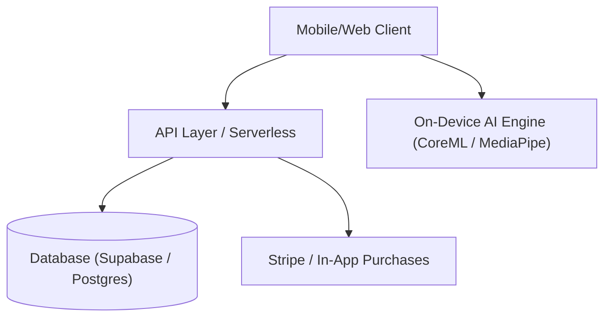

# Technical Architecture Blueprint Template

For every idea that receives an **APPROVED (6/6)** rating, automatically generate a `docs/<idea_slug>_blueprint.md` file using this exact structure:

```markdown
# 🏗️ Technical Architecture Blueprint: [Idea Name]

**Status**: APPROVED (6/6 Proofs Passed)  
**Target MVP Build Time**: [e.g. 2 Weeks]  
**Primary Execution Stack**: [e.g. Flutter / Next.js + Supabase + Native APIs]

---

## 1. System Architecture Overview



---

## 2. Database Schema (Postgres / Supabase SQL DDL)

```sql
-- Core User Profile Table
CREATE TABLE public.profiles (
    id UUID PRIMARY KEY REFERENCES auth.users(id) ON DELETE CASCADE,
    email TEXT NOT NULL,
    subscription_tier TEXT DEFAULT 'free',
    created_at TIMESTAMPTZ DEFAULT NOW()
);

-- Core Entity Table
CREATE TABLE public.entities (
    id UUID PRIMARY KEY DEFAULT gen_random_uuid(),
    user_id UUID REFERENCES public.profiles(id) ON DELETE CASCADE,
    metadata JSONB DEFAULT '{}'::jsonb,
    created_at TIMESTAMPTZ DEFAULT NOW()
);
```

---

## 3. Core API Endpoints & Contract Specs

| Endpoint | Method | Input Payload | Output Response | Purpose |
|---|---|---|---|---|
| `/api/v1/analyze` | POST | `{ "payload": "..." }` | `{ "status": "success", "data": {} }` | Primary Processing Pipeline |
| `/api/v1/webhooks/stripe` | POST | Stripe Event | `{ "received": true }` | Subscription Sync |

---

## 4. UI/UX Layout Tokens & Screen Hierarchy

- **Screen 1**: Onboarding & Permission Grant (Camera/Mic/OAuth)
- **Screen 2**: Primary Camera / Workspace HUD
- **Screen 3**: Analysis Results & 1-Tap Export Certificate
- **Color Palette Tokens**: Primary `#10B981` (Emerald), Dark HUD `#0F172A` (Slate 900), Accent `#F59E0B` (Amber)

---

## 5. Solopreneur MVP Implementation Roadmap (Day 1 - Day 14)

- **Day 1–3**: Core Mechanics Engine / On-Device AI Pipeline MVP
- **Day 4–7**: UI Layout & State Management Integration
- **Day 8–10**: Supabase Auth, DB Schemas & Stripe Billing Setup
- **Day 11–14**: App Store / Product Hunt Launch Assets & Video Clip Recording
```
