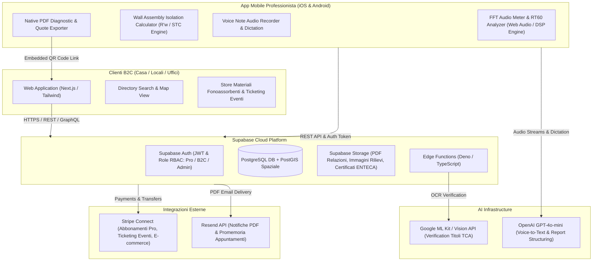

# Technical Architecture Blueprint: AcoustiPedia AI

## System Architecture Diagram (Mermaid)



---

## Database DDL Schema (PostgreSQL / Supabase SQL)

```sql
-- Abilita estensioni per ID UUID e query spaziali (PostGIS)
CREATE EXTENSION IF NOT EXISTS "uuid-ossp";
CREATE EXTENSION IF NOT EXISTS "postgis";

-- 1. Tabella Profili Utenti (Common Auth User Extension)
CREATE TABLE public.profiles (
    id UUID PRIMARY KEY REFERENCES auth.users(id) ON DELETE CASCADE,
    email TEXT UNIQUE NOT NULL,
    full_name TEXT NOT NULL,
    user_type TEXT NOT NULL CHECK (user_type IN ('b2c_client', 'professional', 'company', 'admin')),
    phone TEXT,
    avatar_url TEXT,
    created_at TIMESTAMPTZ DEFAULT NOW(),
    updated_at TIMESTAMPTZ DEFAULT NOW()
);

-- 2. Tabella Professionisti & Società (Schede Verificate TCA)
CREATE TABLE public.professionals (
    id UUID PRIMARY KEY DEFAULT uuid_generate_v4(),
    profile_id UUID UNIQUE NOT NULL REFERENCES public.profiles(id) ON DELETE CASCADE,
    business_name TEXT NOT NULL,
    category TEXT NOT NULL CHECK (category IN ('tecnico_competente_acustica', 'ingegnere_acustico', 'architetto_acustico', 'impresa_insonorizzazione', 'perito_legale')),
    enteca_registration_number TEXT, -- Numero Iscrizione Elenco Nazionale ENTECA
    is_verified BOOLEAN DEFAULT FALSE,
    verification_documents JSONB DEFAULT '[]'::jsonb, -- Array file URL certificati
    bio TEXT,
    specializations TEXT[] DEFAULT '{}', -- es: ['rumore_condominiale', 'acustica_locali', 'perizie_legali', 'bonifica_industriale']
    address TEXT,
    city TEXT NOT NULL,
    province VARCHAR(2) NOT NULL,
    location GEOGRAPHY(POINT, 4326), -- Coordinate GPS per ricerche per prossimità
    hourly_rate DECIMAL(10, 2),
    badge_widget_key UUID DEFAULT uuid_generate_v4(),
    rating_avg DECIMAL(3, 2) DEFAULT 5.00,
    reviews_count INT DEFAULT 0,
    subscription_tier TEXT DEFAULT 'basic' CHECK (subscription_tier IN ('basic', 'pro', 'enterprise')),
    created_at TIMESTAMPTZ DEFAULT NOW()
);

-- Index spaziale PostGIS per ricerca rapida professionisti vicini
CREATE INDEX idx_professionals_location ON public.professionals USING GIST (location);

-- 3. Tabella Servizi Offerti
CREATE TABLE public.services (
    id UUID PRIMARY KEY DEFAULT uuid_generate_v4(),
    professional_id UUID NOT NULL REFERENCES public.professionals(id) ON DELETE CASCADE,
    title TEXT NOT NULL,
    description TEXT NOT NULL,
    price_starting_from DECIMAL(10, 2),
    service_type TEXT NOT NULL CHECK (service_type IN ('perizia_acustica', 'rilievo_fonometrico', 'progetto_insonorizzazione', 'consulenza_online', 'valutazione_impatto_acustico')),
    created_at TIMESTAMPTZ DEFAULT NOW()
);

-- 4. Tabella Eventi, Seminari e Corso Formazione
CREATE TABLE public.events (
    id UUID PRIMARY KEY DEFAULT uuid_generate_v4(),
    organizer_id UUID NOT NULL REFERENCES public.professionals(id) ON DELETE CASCADE,
    title TEXT NOT NULL,
    description TEXT NOT NULL,
    event_type TEXT NOT NULL CHECK (event_type IN ('webinar_online', 'seminario_in_presenza', 'corso_aggiornamento_tca', 'workshop_pratico')),
    start_date TIMESTAMPTZ NOT NULL,
    end_date TIMESTAMPTZ NOT NULL,
    location_name TEXT,
    price DECIMAL(10, 2) DEFAULT 0.00,
    max_attendees INT,
    tickets_sold INT DEFAULT 0,
    cover_image_url TEXT,
    created_at TIMESTAMPTZ DEFAULT NOW()
);

-- 5. Tabella Articoli & Pubblicazioni Tecniche
CREATE TABLE public.articles (
    id UUID PRIMARY KEY DEFAULT uuid_generate_v4(),
    author_id UUID NOT NULL REFERENCES public.professionals(id) ON DELETE CASCADE,
    title TEXT NOT NULL,
    slug TEXT UNIQUE NOT NULL,
    summary TEXT NOT NULL,
    content TEXT NOT NULL, -- Formato Markdown / HTML
    category TEXT NOT NULL CHECK (category IN ('guide_b2c', 'normativa_acustica', 'case_study', 'tecniche_isolamento')),
    published_at TIMESTAMPTZ DEFAULT NOW(),
    views_count INT DEFAULT 0
);

-- 6. Tabella Vetrina Prodotti & Materiali Fonoassorbenti
CREATE TABLE public.products (
    id UUID PRIMARY KEY DEFAULT uuid_generate_v4(),
    seller_id UUID NOT NULL REFERENCES public.professionals(id) ON DELETE CASCADE,
    name TEXT NOT NULL,
    description TEXT NOT NULL,
    price DECIMAL(10, 2) NOT NULL,
    category TEXT NOT NULL CHECK (category IN ('pannelli_fonoassorbenti', 'guaine_acustiche', 'fonometri_accessori', 'porte_fonoisolanti', 'kit_fai_da_te')),
    image_url TEXT,
    stock_quantity INT DEFAULT 10,
    is_active BOOLEAN DEFAULT TRUE,
    created_at TIMESTAMPTZ DEFAULT NOW()
);

-- 7. Tabella Rilievi & Preventivi Mobile App (Field Reports)
CREATE TABLE public.field_inspections (
    id UUID PRIMARY KEY DEFAULT uuid_generate_v4(),
    professional_id UUID NOT NULL REFERENCES public.professionals(id) ON DELETE CASCADE,
    client_name TEXT NOT NULL,
    client_phone TEXT,
    property_address TEXT NOT NULL,
    noise_category TEXT CHECK (noise_category IN ('vicini_calpestio', 'vicini_vocale', 'traffico_stradale', 'impianti_hvac', 'locale_commerciale')),
    measured_dba_level DECIMAL(5, 2),
    measured_rt60_seconds DECIMAL(4, 2),
    target_isolation_rw INT,
    summary_notes TEXT,
    pdf_report_url TEXT,
    status TEXT DEFAULT 'draft' CHECK (status IN ('draft', 'sent_to_client', 'approved', 'declined')),
    created_at TIMESTAMPTZ DEFAULT NOW()
);

-- Row Level Security (RLS) Policies
ALTER TABLE public.profiles ENABLE ROW LEVEL SECURITY;
ALTER TABLE public.professionals ENABLE ROW LEVEL SECURITY;
ALTER TABLE public.field_inspections ENABLE ROW LEVEL SECURITY;

CREATE POLICY "Public read for profiles" ON public.profiles FOR SELECT USING (true);
CREATE POLICY "Public read for professionals" ON public.professionals FOR SELECT USING (true);
CREATE POLICY "Professionals manage own field inspections" ON public.field_inspections 
    FOR ALL USING (auth.uid() IN (SELECT profile_id FROM public.professionals WHERE id = professional_id));
```

---

## Core API Endpoints & Data Contracts

### 1. `POST /api/v1/inspections/generate-report` (Mobile App API)
Riceve i dati del rilievo acustico e le note vocali registrate dall'app mobile, genera la relazione strutturata con GPT-4o-mini e restituisce l'URL del PDF firmato.

- **Request Payload**:
```json
{
  "client_name": "Mario Rossi",
  "property_address": "Via Roma 45, Milano",
  "noise_category": "vicini_calpestio",
  "measurements": {
    "background_noise_dba": 42.5,
    "peak_impact_dba": 68.1,
    "estimated_rt60_sec": 1.12,
    "wall_type": "forati_doppia_parete_senza_isolante"
  },
  "voice_notes_transcript": "Cliente lamenta rumori di calpestio notturno dal piano superiore. Parete divisoria vuota da 12 cm. Consiglio placcaggio con cartongesso accoppiato a gomma piombo da 40 mm e lana di roccia high-density.",
  "photos_base64": ["data:image/jpeg;base64,..."]
}
```

- **Response Contract**:
```json
{
  "inspection_id": "8f2a1b90-4c3e-4122-a987-99b871c55d01",
  "suggested_rw_improvement_db": 18,
  "generated_summary": "Rilevato forte superamento dei limiti di rumorosità da calpestio (L'nW = 68 dB). Si consiglia l'installazione di una controparete galleggiante acustica.",
  "pdf_download_url": "https://storage.acoustipedia.com/reports/inspection_8f2a1b90.pdf",
  "qr_code_client_link": "https://acoustipedia.com/pro/studio-acustico-milano?ref=insp_8f2a1b90"
}
```

---

## UI/UX Screen Hierarchy & Design System

### Palette Colori & Tokens Visuali
- **Primary Color**: Deep Navy `#0F172A` (Trasmette autorevolezza ingegneristica e precisione).
- **Secondary / Accent**: Sound Cyan `#06B6D4` (Rappresenta le onde sonore e l'innovazione digitale).
- **Status Green**: Verified Emerald `#10B981` (Per il badge dei professionisti ENTECA verificati).
- **Background Slate**: `#F8FAFC` (Layout pulito, moderno ed ultra-scannabile).
- **Typography**: `Inter` per testi d'interfaccia e `Outfit` per le titolazioni e le metriche decibel/frequenza.

### Screen Hierarchy Overview

```
┌────────────────────────────────────────────────────────────────────────┐
│                        WEB PORTAL (B2C & PRO)                          │
├────────────────────────────────────────────────────────────────────────┤
│ 1. Home Page: Hero Search ("Trova Tecnici Acustici Verificati a [Città]")│
│ 2. Directory & Mappa Mappa Interattiva Tecnici TCA                    │
│ 3. Scheda Dettaglio Professionista (Badge ENTECA, Servizi, Recensioni) │
│ 4. Portale Eventi & Webinar (Biglietteria Stripe Connect)             │
│ 5. Hub Articoli & Pubblicazioni Tecniche (SEO Long-Tail)               │
│ 6. Marketplace Materiali Fonoassorbenti Certificati                   │
│ 7. Dashboard Professionista (Gestione Scheda, Eventi, Leads, Sales)    │
└────────────────────────────────────────────────────────────────────────┘

┌────────────────────────────────────────────────────────────────────────┐
│                       CONNECTED MOBILE FIELD APP                       │
├────────────────────────────────────────────────────────────────────────┤
│ 1. Dashboard Rilievi ("Nuovo Sopralluogo")                             │
│ 2. FFT Sound Level Meter (Visualizzatore dBA/dBC a 60 FPS)             │
│ 3. Calcolatore Isolamento Pareti & RT60 Riverbero                      │
│ 4. Recorder Vocale Note & Foto Cantiere                                │
│ 5. Anteprima & Generazione Relazione Diagnostic PDF con QR Code        │
└────────────────────────────────────────────────────────────────────────┘
```

---

## Solopreneur MVP Implementation Roadmap (Day 1 - Day 12)

- **Giorno 1-2: Setup Infrastruttura & Schema DB**
  - Inizializzazione repository Monorepo (Next.js 14 App Router + Expo React Native).
  - Provisioning del database Supabase, configurazione estensione PostGIS e migration SQL DDL.
  - Setup autenticazione Supabase Auth con ruoli (B2C Client, Professional, Admin).

- **Giorno 3-5: Sviluppo Web Portal B2C & Dashboard Pro**
  - Creazione delle pagine di Directory con filtri spaziali PostGIS (per città/provincia) e ricerca per categoria.
  - Sviluppo della Scheda Professionista pubblica con tab Servizi, Articoli, Recensioni e Form di Contatto.
  - Implementazione Dashboard Professionista per la gestione del profilo e caricamento documenti ENTECA.

- **Giorno 6-7: Integrzione Stripe Connect & Eventi/Marketplace**
  - Configurazione Stripe Connect Custom per consentire ai professionisti di vendere biglietti per corsi/webinar e materiali fonoassorbenti.
  - Sviluppo pagine checkout eventi e marketplace prodotti con commissione piattaforma automatica.

- **Giorno 8-9: Sviluppo App Mobile da Campo (React Native / Expo)**
  - Implementazione del modulo FFT Sound Level Meter con Web Audio API per la lettura decibel.
  - Sviluppo calcolatore deterministico pareti ($\Delta R'_w$) e form compilazione sopralluogo cliente.

- **Giorno 10-11: Integrazione AI (OCR Certificati + Voice-to-PDF Report)**
  - Implementazione Edge Function per l'OCR automatico degli attestati ENTECA dei professionisti.
  - Integrazione OpenAI GPT-4o-mini per trascrizione note vocali ed elaborazione del testo della relazione PDF.
  - Generazione dinamica PDF con QR Code che punta al profilo del professionista sul portale web.

- **Giorno 12: Testing Finale, Compliance & Launch**
  - Verifiche di sicurezza RLS, test di risposta misurazione audio su 3 dispositivi mobile fisici.
  - Inserimento disclaimers legali di prova fonometrica e pubblicazione su Vercel (Web) ed Expo Application Services / TestFlight (Mobile).
