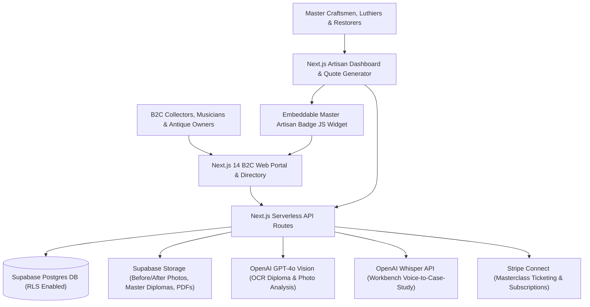

# 🏗️ Technical Architecture Blueprint: CraftPedia AI

**Status**: APPROVED (7/7 Proofs Passed)  
**Target MVP Build Time**: 10–12 Days (Solopreneur Stack)  
**Primary Execution Stack**: Next.js 14 (App Router) + Supabase (PostgreSQL, Auth, Storage) + Stripe Connect + OpenAI GPT-4o Vision & Whisper API

---

## 1. System Architecture Overview



---

## 2. Database Schema (Postgres / Supabase SQL DDL)

```sql
-- Enable UUID extension
CREATE EXTENSION IF NOT EXISTS "uuid-ossp";

-- 1. Profiles Table (Extended Auth)
CREATE TABLE public.profiles (
    id UUID PRIMARY KEY REFERENCES auth.users(id) ON DELETE CASCADE,
    role TEXT NOT NULL CHECK (role IN ('b2c_client', 'artisan', 'bottega_studio')),
    full_name TEXT NOT NULL,
    email TEXT UNIQUE NOT NULL,
    phone TEXT,
    avatar_url TEXT,
    created_at TIMESTAMPTZ DEFAULT NOW(),
    updated_at TIMESTAMPTZ DEFAULT NOW()
);

-- 2. Artisan Cards Table (Scheda Bottega / Maestro)
CREATE TABLE public.artisan_cards (
    id UUID PRIMARY KEY DEFAULT gen_random_uuid(),
    profile_id UUID REFERENCES public.profiles(id) ON DELETE CASCADE,
    slug TEXT UNIQUE NOT NULL,
    workshop_name TEXT NOT NULL, -- e.g. "Bottega Liutaria Stradivari & Figli"
    master_name TEXT NOT NULL,
    craft_category TEXT NOT NULL CHECK (craft_category IN ('liuteria', 'restauro_dipinti', 'ebanisteria_mobili', 'orologeria_epoca', 'doratura_vetrate', 'restauro_sculture')),
    bio TEXT NOT NULL,
    years_experience INT DEFAULT 10,
    is_verified BOOLEAN DEFAULT FALSE,
    verification_documents TEXT[], -- URLs to uploaded diplomas in Supabase Storage
    city TEXT NOT NULL,
    province TEXT NOT NULL,
    region TEXT NOT NULL,
    workshop_address TEXT,
    services JSONB DEFAULT '[]'::jsonb, -- e.g. [{ "name": "Messa a punto e Setup Violino", "price_from": 120 }]
    stripe_connect_id TEXT,
    subscription_tier TEXT DEFAULT 'free' CHECK (subscription_tier IN ('free', 'pro', 'bottega')),
    rating_avg NUMERIC(3,2) DEFAULT 0.0,
    reviews_count INT DEFAULT 0,
    created_at TIMESTAMPTZ DEFAULT NOW()
);

-- 3. Masterclasses & Stage Table (Biglietteria Corsi dal Vivo)
CREATE TABLE public.masterclasses (
    id UUID PRIMARY KEY DEFAULT gen_random_uuid(),
    artisan_id UUID REFERENCES public.artisan_cards(id) ON DELETE CASCADE,
    slug TEXT UNIQUE NOT NULL,
    title TEXT NOT NULL,
    description TEXT NOT NULL,
    craft_category TEXT NOT NULL,
    event_date TIMESTAMPTZ NOT NULL,
    end_date TIMESTAMPTZ,
    location_name TEXT NOT NULL,
    address TEXT,
    city TEXT NOT NULL,
    is_online BOOLEAN DEFAULT FALSE,
    price_cents INT NOT NULL,
    max_attendees INT NOT NULL,
    attendees_count INT DEFAULT 0,
    cover_image_url TEXT,
    stripe_price_id TEXT,
    status TEXT DEFAULT 'published' CHECK (status IN ('draft', 'published', 'sold_out', 'cancelled')),
    created_at TIMESTAMPTZ DEFAULT NOW()
);

-- 4. Masterclass Tickets
CREATE TABLE public.masterclass_tickets (
    id UUID PRIMARY KEY DEFAULT gen_random_uuid(),
    masterclass_id UUID REFERENCES public.masterclasses(id) ON DELETE CASCADE,
    buyer_user_id UUID REFERENCES public.profiles(id) ON DELETE SET NULL,
    buyer_name TEXT NOT NULL,
    buyer_email TEXT NOT NULL,
    ticket_code TEXT UNIQUE NOT NULL,
    stripe_checkout_session_id TEXT UNIQUE,
    amount_paid_cents INT NOT NULL,
    status TEXT DEFAULT 'valid' CHECK (status IN ('valid', 'used', 'refunded')),
    purchased_at TIMESTAMPTZ DEFAULT NOW()
);

-- 5. Case Studies & Restoration Log (Casi Studio Prima/Dopo)
CREATE TABLE public.case_studies (
    id UUID PRIMARY KEY DEFAULT gen_random_uuid(),
    artisan_id UUID REFERENCES public.artisan_cards(id) ON DELETE CASCADE,
    slug TEXT UNIQUE NOT NULL,
    title TEXT NOT NULL,
    artwork_type TEXT NOT NULL, -- e.g. "Violino 700 Francese", "Cassettone Barocco Intarsiato"
    summary TEXT NOT NULL,
    technical_process_markdown TEXT NOT NULL,
    before_photos TEXT[],
    after_photos TEXT[],
    views_count INT DEFAULT 0,
    is_published BOOLEAN DEFAULT TRUE,
    created_at TIMESTAMPTZ DEFAULT NOW()
);

-- 6. Specialized Materials & Restored Works Shop (Vetrina Materiali & Pezzi)
CREATE TABLE public.specialized_shop_items (
    id UUID PRIMARY KEY DEFAULT gen_random_uuid(),
    artisan_id UUID REFERENCES public.artisan_cards(id) ON DELETE CASCADE,
    title TEXT NOT NULL,
    item_type TEXT NOT NULL CHECK (item_type IN ('materiale_specialistico', 'opera_restaurata', 'strumento_d_epoca')),
    price_cents INT NOT NULL,
    description TEXT NOT NULL,
    images TEXT[],
    stripe_product_id TEXT,
    in_stock BOOLEAN DEFAULT TRUE,
    created_at TIMESTAMPTZ DEFAULT NOW()
);

-- RLS Policies
ALTER TABLE public.profiles ENABLE ROW LEVEL SECURITY;
ALTER TABLE public.artisan_cards ENABLE ROW LEVEL SECURITY;
ALTER TABLE public.masterclasses ENABLE ROW LEVEL SECURITY;
ALTER TABLE public.masterclass_tickets ENABLE ROW LEVEL SECURITY;
ALTER TABLE public.case_studies ENABLE ROW LEVEL SECURITY;
ALTER TABLE public.specialized_shop_items ENABLE ROW LEVEL SECURITY;

-- Public Read Policies
CREATE POLICY "Public artisan cards are viewable by everyone" ON public.artisan_cards FOR SELECT USING (true);
CREATE POLICY "Public masterclasses are viewable by everyone" ON public.masterclasses FOR SELECT USING (status = 'published');
CREATE POLICY "Public case studies are viewable by everyone" ON public.case_studies FOR SELECT USING (is_published = true);
CREATE POLICY "Public shop items are viewable by everyone" ON public.specialized_shop_items FOR SELECT USING (in_stock = true);
```

---

## 3. Core API Endpoints & Contract Specs

| Endpoint | Method | Input Payload | Output Response | Purpose |
|---|---|---|---|---|
| `/api/v1/artisans/verify-ocr` | POST | `{ "artisan_id": "uuid", "diploma_url": "https://..." }` | `{ "status": "verified", "extracted_data": { "school": "Scuola Internazionale Liuteria Cremona" } }` | OCR automatico diplomi bottega/accademia tramite GPT-4o Vision |
| `/api/v1/case-studies/workbench-voice` | POST | `{ "audio_url": "https://..." }` | `{ "status": "success", "case_study": { "title": "...", "content": "..." } }` | Trascrizione Whisper e formattazione caso studio da note al banco |
| `/api/v1/masterclasses/create-checkout` | POST | `{ "masterclass_id": "uuid", "buyer_email": "..." }` | `{ "checkout_url": "https://checkout.stripe.com/..." }` | Inizializzazione Stripe Connect per biglietto masterclass |
| `/api/v1/webhooks/stripe` | POST | Stripe Event Headers & Webhook Payload | `{ "received": true }` | Aggiornamento stato biglietti e vendite pezzi/materiali |
| `/api/v1/widget/master-badge.js` | GET | `?slug=artisan-slug` | Dynamic JavaScript Render | Badge dinamico incorporabile per il sito della bottega |

---

## 4. UI/UX Layout Tokens & Screen Hierarchy

### Screen Hierarchy
- **Screen 1**: B2C Home & Search Hub (Filtri per Città, Categoria: Liuteria, Restauro Dipinti, Ebanisteria, Orologeria, Doratura).
- **Screen 2**: Scheda Bottega / Maestro (Badge Verificato, Bio, Galleria Lavori, Servizi/Messa a punto, Masterclass in programma, Casi Studio Prima/Dopo, Vetrina Pezzi).
- **Screen 3**: Portale Masterclass & Stage (Calendario nazionale, Dettaglio programma, Modal acquisto biglietto in 2 tap).
- **Screen 4**: Dashboard Artigiano (Gestione profilo, Upload diplomi per OCR, Dettatore Vocale Casi Studio al Banco, Creazione Masterclass con Stripe, Codice Widget Badge).

### Color Palette Tokens
- **Primary Color**: `#78350F` (Amber 900 - Caldo legno pregiato, artigianalità e prestigio)
- **Secondary Accent**: `#D97706` (Amber 600 - Ottone, doratura ed energia per CTA)
- **Dark Neutral**: `#1C1917` (Warm Stone 900 - Sfondo scuro elegante e scritte)
- **Light Background**: `#FAFAF9` (Stone 50 - Carta pregiata per schede e casi studio)
- **Status Gold**: `#F59E0B` (Amber 500 - Badge "Maestro Artigiano Verificato")

---

## 5. Solopreneur MVP Implementation Roadmap (Day 1 - Day 12)

- **Giorno 1–3 (Core DB & Layout)**: Setup Next.js 14, Supabase (migrazioni SQL, RLS, Auth) e layout responsive Tailwind orientato all'alto artigianato.
- **Giorno 4–5 (Schede Botteghe & Search Engine)**: Form registrazioni artigiani, filtro per specializzazione (Liuteria, Ebanisteria, ecc.) e pSEO.
- **Giorno 6–7 (Biglietteria Masterclass & Stripe Connect)**: Integrazione Stripe Connect Express per vendita biglietti ed oggetti.
- **Giorno 8–9 (AI Features & Widget Badge)**: Pipeline Vision OCR diplomi e widget `master-badge.js` incorporabile per i siti esterni delle botteghe.
- **Giorno 10–11 (Casi Studio Prima/Dopo & Workbench Voice)**: Implementazione sezione casi studio con trascrizione Whisper dal banco di lavoro.
- **Giorno 12 (Polish & Launch)**: Testing end-to-end B2C/B2B e deploy su Vercel.
