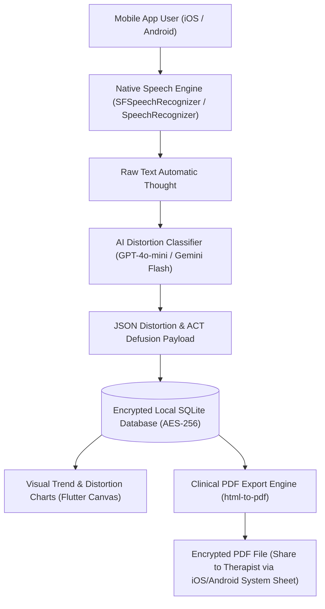

# 🏗️ Technical Architecture Blueprint: DefuseFlow AI

**Status**: APPROVED (6/6 Proofs Passed)  
**Target MVP Build Time**: 7 Days  
**Primary Execution Stack**: Flutter (Dart) / React Native + On-Device SQLite (AES-256) + Native Speech API + Structured LLM API

---

## 1. System Architecture Overview



---

## 2. Database Schema (Local SQLite DDL)

```sql
-- Encrypted Core Thought Record Table
CREATE TABLE IF NOT EXISTS thought_records (
    id TEXT PRIMARY KEY,
    created_at TIMESTAMP DEFAULT CURRENT_TIMESTAMP,
    raw_thought TEXT NOT NULL,
    primary_distortion TEXT NOT NULL,
    secondary_distortions TEXT, -- JSON array of extra distortions
    act_defusion_exercise_id TEXT NOT NULL,
    initial_belief_rating INTEGER NOT NULL, -- 0 to 100
    post_defusion_belief_rating INTEGER NOT NULL, -- 0 to 100
    reframed_rational_thought TEXT,
    notes TEXT
);

-- Distortion Metadata Reference Table
CREATE TABLE IF NOT EXISTS cognitive_distortions (
    id TEXT PRIMARY KEY,
    name TEXT NOT NULL,
    description TEXT NOT NULL,
    reframing_prompt_template TEXT NOT NULL
);

-- User Preferences & Lock Pin
CREATE TABLE IF NOT EXISTS user_settings (
    id INTEGER PRIMARY KEY CHECK (id = 1),
    biometric_lock_enabled BOOLEAN DEFAULT TRUE,
    therapist_email TEXT,
    preferred_voice_language TEXT DEFAULT 'en-US',
    subscription_status TEXT DEFAULT 'free' -- 'free', 'pro_monthly', 'pro_lifetime'
);
```

---

## 3. Core API Endpoints & Contract Specs

### 3.1 On-Device / Cloud Classification Request (`/api/v1/classify-thought`)

- **Method**: POST
- **Input Payload**:
```json
{
  "raw_thought": "I made a minor error during the client presentation, so my manager is definitely going to fire me tomorrow.",
  "language": "en-US"
}
```
- **Output Response**:
```json
{
  "status": "success",
  "primary_distortion": "Catastrophizing",
  "secondary_distortions": ["Mind Reading", "All-or-Nothing Thinking"],
  "confidence_score": 0.98,
  "act_defusion_recommendation": {
    "exercise_id": "defuse_singing_voice",
    "title": "Sing the Thought",
    "instruction": "Repeat the thought out loud in the voice of a cartoon character or sung like a silly tune for 30 seconds."
  },
  "reframing_questions": [
    "What is the actual evidence that you will be fired tomorrow?",
    "Has a minor presentation error ever resulted in termination before?"
  ]
}
```

---

## 4. UI/UX Layout Tokens & Screen Hierarchy

### Screen Hierarchy
1. **Screen 1: Acute Thought Capture HUD (1-Tap Voice / Text)**
   - Large tactile microphone recording button with live audio wave pulse.
   - Quick text fallback input field.
2. **Screen 2: Distortion Analysis & ACT Defusion Wizard**
   - Highlighted Cognitive Distortion badge with 1-sentence plain English explanation.
   - Interactive 30-second ACT Defusion exercise card (interactive timer, voice playback, or reframing prompt).
   - Initial vs. Post-Defusion Belief Slider (0% - 100%).
3. **Screen 3: Weekly Dashboard & 1-Tap Therapist PDF Exporter**
   - Distortion pie chart & mood trajectory graph over time.
   - 1-Tap "Export Weekly Session Summary" button generating a clean, clinical 1-page PDF grid.

### Color Palette Tokens
- **Primary Action**: `#6366F1` (Indigo 500 — Calming & Professional)
- **Background Dark Mode**: `#0F172A` (Slate 900)
- **Card Background**: `#1E293B` (Slate 800)
- **Accent Highlight**: `#10B981` (Emerald 500 — Positive Reframing)
- **Distortion Tag**: `#F59E0B` (Amber 500)

---

## 5. Solopreneur MVP Implementation Roadmap (Day 1 - Day 14)

- **Day 1–2**: Project setup in Flutter / React Native + SQLite encrypted database layer + Native Speech-to-Text integration.
- **Day 3–4**: OpenAI `gpt-4o-mini` / Gemini Flash JSON schema prompt integration for instant distortion classification & ACT exercise selector.
- **Day 5–6**: UI/UX screen build (Voice Capture HUD, Distortion Wizard, Belief Slider, Trend Charts).
- **Day 7–8**: Local HTML-to-PDF clinical report generator + native Share Sheet integration.
- **Day 9–10**: In-App Purchases integration (RevenueCat / RevenueCat SDK for iOS App Store & Google Play $4.99/mo subscription).
- **Day 11–12**: Biometric lock screen (FaceID / TouchID) & medical disclaimer onboarding.
- **Day 13–14**: App Store / Google Play submission & launch on Reddit (/r/CBT, /r/ACT) and TikTok organic video demo.
