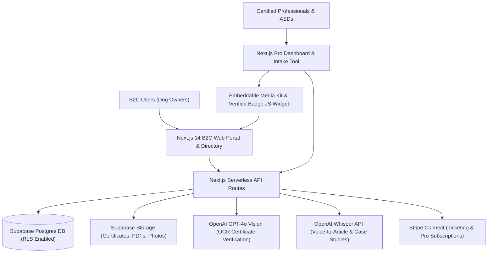

# 🏗️ Technical Architecture Blueprint: EthoPedia AI

**Status**: APPROVED (7/7 Proofs Passed)  
**Target MVP Build Time**: 10–12 Days (Solopreneur Stack)  
**Primary Execution Stack**: Next.js 14 (App Router) + Supabase (PostgreSQL, Auth, Storage) + Stripe Connect + OpenAI GPT-4o Vision & Whisper API

---

## 1. System Architecture Overview



---

## 2. Database Schema (Postgres / Supabase SQL DDL)

```sql
-- Enable UUID extension
CREATE EXTENSION IF NOT EXISTS "uuid-ossp";

-- 1. Profiles Table (Extended Auth)
CREATE TABLE public.profiles (
    id UUID PRIMARY KEY REFERENCES auth.users(id) ON DELETE CASCADE,
    role TEXT NOT NULL CHECK (role IN ('b2c_user', 'professional', 'center_asd')),
    full_name TEXT NOT NULL,
    email TEXT UNIQUE NOT NULL,
    phone TEXT,
    avatar_url TEXT,
    created_at TIMESTAMPTZ DEFAULT NOW(),
    updated_at TIMESTAMPTZ DEFAULT NOW()
);

-- 2. Professional Profiles Table (Scheda Professionale)
CREATE TABLE public.professional_cards (
    id UUID PRIMARY KEY DEFAULT gen_random_uuid(),
    profile_id UUID REFERENCES public.profiles(id) ON DELETE CASCADE,
    slug TEXT UNIQUE NOT NULL,
    title TEXT NOT NULL, -- e.g. "Educatore Cinofilo Comportamentista UNI 11790"
    bio TEXT NOT NULL,
    qualifications JSONB DEFAULT '[]'::jsonb, -- e.g. ["UNI 11790", "ENCI Addestratore", "Fisioterapia"]
    is_verified BOOLEAN DEFAULT FALSE,
    verification_documents TEXT[], -- URLs to uploaded certificates in Supabase Storage
    verified_at TIMESTAMPTZ,
    city TEXT NOT NULL,
    province TEXT NOT NULL,
    region TEXT NOT NULL,
    location_coordinates POINT,
    services JSONB DEFAULT '[]'::jsonb, -- e.g. [{ "name": "Valutazione Comportamentale", "price": 80, "duration_min": 90 }]
    stripe_connect_id TEXT,
    subscription_tier TEXT DEFAULT 'free' CHECK (subscription_tier IN ('free', 'pro', 'studio')),
    rating_avg NUMERIC(3,2) DEFAULT 0.0,
    reviews_count INT DEFAULT 0,
    created_at TIMESTAMPTZ DEFAULT NOW()
);

-- 3. Events & Stage Table (Biglietteria Eventi / Seminari)
CREATE TABLE public.events (
    id UUID PRIMARY KEY DEFAULT gen_random_uuid(),
    organizer_id UUID REFERENCES public.professional_cards(id) ON DELETE CASCADE,
    slug TEXT UNIQUE NOT NULL,
    title TEXT NOT NULL,
    description TEXT NOT NULL,
    category TEXT NOT NULL CHECK (category IN ('stage_pratico', 'seminario_teorico', 'webinar_online', 'corso_formazione')),
    event_date TIMESTAMPTZ NOT NULL,
    end_date TIMESTAMPTZ,
    location_name TEXT NOT NULL,
    address TEXT,
    city TEXT NOT NULL,
    is_online BOOLEAN DEFAULT FALSE,
    price_cents INT NOT NULL,
    max_tickets INT NOT NULL,
    tickets_sold INT DEFAULT 0,
    cover_image_url TEXT,
    stripe_price_id TEXT,
    status TEXT DEFAULT 'published' CHECK (status IN ('draft', 'published', 'sold_out', 'cancelled')),
    created_at TIMESTAMPTZ DEFAULT NOW()
);

-- 4. Event Tickets Purchased
CREATE TABLE public.tickets (
    id UUID PRIMARY KEY DEFAULT gen_random_uuid(),
    event_id UUID REFERENCES public.events(id) ON DELETE CASCADE,
    buyer_user_id UUID REFERENCES public.profiles(id) ON DELETE SET NULL,
    buyer_name TEXT NOT NULL,
    buyer_email TEXT NOT NULL,
    ticket_code TEXT UNIQUE NOT NULL,
    stripe_checkout_session_id TEXT UNIQUE,
    amount_paid_cents INT NOT NULL,
    status TEXT DEFAULT 'valid' CHECK (status IN ('valid', 'used', 'refunded')),
    purchased_at TIMESTAMPTZ DEFAULT NOW()
);

-- 5. Technical Articles & Case Studies (Pubblicazioni)
CREATE TABLE public.articles (
    id UUID PRIMARY KEY DEFAULT gen_random_uuid(),
    author_id UUID REFERENCES public.professional_cards(id) ON DELETE CASCADE,
    slug TEXT UNIQUE NOT NULL,
    title TEXT NOT NULL,
    summary TEXT NOT NULL,
    content_markdown TEXT NOT NULL,
    tags TEXT[],
    cover_image_url TEXT,
    views_count INT DEFAULT 0,
    likes_count INT DEFAULT 0,
    is_published BOOLEAN DEFAULT TRUE,
    created_at TIMESTAMPTZ DEFAULT NOW()
);

-- 6. Recommended Products Catalog (Vetrina Prodotti Curati)
CREATE TABLE public.products (
    id UUID PRIMARY KEY DEFAULT gen_random_uuid(),
    recommender_id UUID REFERENCES public.professional_cards(id) ON DELETE CASCADE,
    name TEXT NOT NULL,
    category TEXT NOT NULL, -- e.g. "Pettorine ad H", "Lunghine 5m", "Giochi Cognitivi", "Integratori"
    description TEXT NOT NULL,
    image_url TEXT,
    external_buy_url TEXT, -- Affiliate or direct merchant link
    recommended_reason TEXT,
    created_at TIMESTAMPTZ DEFAULT NOW()
);

-- RLS Policies
ALTER TABLE public.profiles ENABLE ROW LEVEL SECURITY;
ALTER TABLE public.professional_cards ENABLE ROW LEVEL SECURITY;
ALTER TABLE public.events ENABLE ROW LEVEL SECURITY;
ALTER TABLE public.tickets ENABLE ROW LEVEL SECURITY;
ALTER TABLE public.articles ENABLE ROW LEVEL SECURITY;
ALTER TABLE public.products ENABLE ROW LEVEL SECURITY;

-- Public read policies
CREATE POLICY "Public profiles are viewable by everyone" ON public.professional_cards FOR SELECT USING (true);
CREATE POLICY "Public events are viewable by everyone" ON public.events FOR SELECT USING (status = 'published');
CREATE POLICY "Public articles are viewable by everyone" ON public.articles FOR SELECT USING (is_published = true);
CREATE POLICY "Public products are viewable by everyone" ON public.products FOR SELECT USING (true);
```

---

## 3. Core API Endpoints & Contract Specs

| Endpoint | Method | Input Payload | Output Response | Purpose |
|---|---|---|---|---|
| `/api/v1/professionals/verify-ocr` | POST | `{ "card_id": "uuid", "document_url": "https://..." }` | `{ "status": "verified", "extracted_data": { "diploma": "UNI 11790", "issuer": "APNEC" } }` | OCR automatico certificati e diplomi tramite GPT-4o Vision |
| `/api/v1/articles/voice-generate` | POST | `{ "audio_url": "https://..." }` | `{ "status": "success", "article": { "title": "...", "content": "..." } }` | Trascrizione Whisper e formattazione markdown articolo |
| `/api/v1/events/create-checkout` | POST | `{ "event_id": "uuid", "buyer_email": "..." }` | `{ "checkout_url": "https://checkout.stripe.com/..." }` | Inizializzazione Stripe Connect per biglietteria evento |
| `/api/v1/webhooks/stripe` | POST | Stripe Event Headers & Webhook Payload | `{ "received": true }` | Aggiornamento stato biglietti e abbonamenti professionisti |
| `/api/v1/widget/badge.js` | GET | `?slug=professionista-slug` | Dynamic JavaScript Render | Badge dinamico incorporabile per i siti dei professionisti |

---

## 4. UI/UX Layout Tokens & Screen Hierarchy

### Screen Hierarchy
- **Screen 1**: B2C Home & Search Hub (Filtri per Città, Specializzazione: Reattività, Cuccioli, Agility, Nosework, Fisioterapia).
- **Screen 2**: Scheda Professionale B2C (Badge Verificato, Bio, Servizi Offerti, Eventi in programma, Articoli pubblicati, Prodotti consigliati, Form contatto/prenotazione).
- **Screen 3**: Portale Eventi & Stage (Calendario nazionale, Scheda dettaglio evento, Modal di acquisto biglietto in 2 tap con Apple Pay/Stripe).
- **Screen 4**: Dashboard Professionista (Gestione profilo, Upload certificati per OCR, Generatore Articoli da Vocale, Creazione Eventi con Stripe, Codice Widget Badge).

### Color Palette Tokens
- **Primary Color**: `#0D9488` (Teal 600 - Rassicurante, professionale, naturale)
- **Secondary Accent**: `#F59E0B` (Amber 500 - Energia per badge verificati e call to action)
- **Dark Neutral**: `#0F172A` (Slate 900 - Testi principali e footer)
- **Light Background**: `#F8FAFC` (Slate 50 - Card pulite e scannabili)
- **Status Green**: `#10B981` (Emerald 500 - Badge "Verificato UNI 11790 / ENCI")

---

## 5. Solopreneur MVP Implementation Roadmap (Day 1 - Day 12)

- **Giorno 1–3 (Core Database & Setup)**: Inizializzazione progetto Next.js 14, setup Supabase DB (migrazioni SQL sopra, RLS, Auth) e layout responsive Tailwind.
- **Giorno 4–5 (Schede Professionali & Search Engine)**: Implementazione form inserimento scheda professionista/società, filtro geografico (Città/Regione) e paginazione pSEO.
- **Giorno 6–7 (Biglietteria Eventi & Stripe Connect)**: Integrazione Stripe Connect Express per permettere ai professionisti di ricevere pagamenti diretti per stage e seminari.
- **Giorno 8–9 (AI Features & Widget Badge)**: Pipeline GPT-4o Vision per OCR dei diplomi e widget JS `badge.js` incorporabile nei siti esterni dei professionisti.
- **Giorno 10–11 (Articoli, Prodotti & Voice-to-Text)**: Implementazione sezione articoli scientifici con dettatura Whisper e vetrina prodotti raccomandati.
- **Giorno 12 (Polish & Launch)**: Testing completo del flusso B2C (ricerca -> biglietto) e B2B (registrazione -> badge) e deploy su Vercel.
