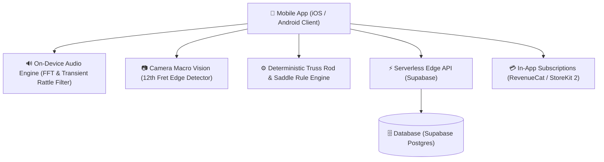

# 🏗️ Technical Architecture Blueprint: FretPulse AI

**Status**: APPROVED (6/6 Proofs Passed)  
**Target MVP Build Time**: 5-7 Days  
**Primary Execution Stack**: Flutter / Native Swift & Kotlin + iOS CoreAudio / Android AAudio + Supabase  

---

## 1. System Architecture Overview



---

## 2. Database Schema (Postgres / Supabase SQL DDL)

```sql
-- Profiles table for registered users
CREATE TABLE public.profiles (
    id UUID PRIMARY KEY REFERENCES auth.users(id) ON DELETE CASCADE,
    email TEXT NOT NULL,
    subscription_tier TEXT DEFAULT 'free', -- 'free' | 'pro'
    created_at TIMESTAMPTZ DEFAULT NOW()
);

-- Guitars (Multi-Instrument Garage)
CREATE TABLE public.guitars (
    id UUID PRIMARY KEY DEFAULT gen_random_uuid(),
    user_id UUID REFERENCES public.profiles(id) ON DELETE CASCADE,
    nickname TEXT NOT NULL, -- e.g. "Fender Stratocaster '62"
    instrument_type TEXT DEFAULT 'electric_guitar', -- 'electric_guitar' | 'acoustic_guitar' | 'bass_guitar'
    number_of_frets INT DEFAULT 22,
    target_action_mm NUMERIC(3, 2) DEFAULT 1.75,
    created_at TIMESTAMPTZ DEFAULT NOW()
);

-- Setup Diagnostics History Log
CREATE TABLE public.setup_logs (
    id UUID PRIMARY KEY DEFAULT gen_random_uuid(),
    guitar_id UUID REFERENCES public.guitars(id) ON DELETE CASCADE,
    action_12th_fret_mm NUMERIC(3, 2),
    buzzing_frets JSONB DEFAULT '[]'::jsonb, -- e.g. ["E_5", "A_7"]
    truss_rod_action TEXT, -- e.g. "TIGHTEN_1_8_TURN"
    health_score INT CHECK (health_score BETWEEN 0 AND 100),
    created_at TIMESTAMPTZ DEFAULT NOW()
);
```

---

## 3. Core API Endpoints & Contract Specs

| Endpoint | Method | Input Payload | Output Response | Purpose |
|---|---|---|---|---|
| `/api/v1/guitars` | GET | Headers: `Bearer Token` | `[ { "id": "...", "nickname": "Strat" } ]` | Fetch user garage |
| `/api/v1/guitars` | POST | `{ "nickname": "Martin D-28", "type": "acoustic" }` | `{ "id": "...", "status": "created" }` | Add new instrument |
| `/api/v1/setup-reports` | POST | `{ "guitar_id": "...", "buzz_data": [...], "action_mm": 1.8 }` | `{ "health_score": 92, "truss_rod_recommendation": "1/8 Turn CCW" }` | Generate setup diagnostic report |

---

## 4. UI/UX Layout Tokens & Screen Hierarchy

- **Screen 1: Instrument Garage HUD**: Multi-guitar carousel with setup health scores, last setup date, and 1-tap "Start New Diagnostic Setup".
- **Screen 2: Guided Audio Buzz Pluck Workspace**: Interactive 2D fretboard interface guiding user to pluck frets 1–21 sequentially while microphone measures acoustic rattle spikes in real-time.
- **Screen 3: 12th Fret Macro Camera HUD**: Guided camera alignment overlay for measuring string height relative to reference pick/coin.
- **Screen 4: Interactive Luthier Diagnostic Report & Truss Rod Guide**: Visual 2D Fretboard Buzz Heatmap + step-by-step truss rod quarter-turn instructions with video safety tips.
- **Color Palette Tokens**:
  - Primary Accent: `#F59E0B` (Amber Gold / Vintage Wood Finish)
  - Secondary Accent: `#10B981` (Emerald Pass)
  - Background HUD: `#0F172A` (Slate Dark Studio)
  - Warning Red: `#EF4444` (Fret Buzz Alert)

---

## 5. Solopreneur MVP Implementation Roadmap (Day 1 - Day 7)

- **Day 1**: Build CoreAudio / AudioRecord microphone stream pipeline + FFT spectral flux transient filter to detect metallic fret rattle transients ($2.5kHz - 8kHz$).
- **Day 2**: Develop deterministic Setup Recommendation Engine (combining buzz fret map + action mm height to derive neck relief & truss rod adjustment).
- **Day 3**: Build Flutter / React Native UI (Interactive 2D Fretboard HUD & Pluck Guide).
- **Day 4**: Integrate Camera Macro Vision calibration view for 12th fret action measurement.
- **Day 5**: Implement Supabase Auth, PostgreSQL schema, and local offline storage backup.
- **Day 6**: Integrate RevenueCat / StoreKit 2 for 1-Tap Pro Garage Unlocks ($4.99).
- **Day 7**: Record #GuitarTok / YouTube Shorts viral demo video showing 60-second fret buzz diagnosis and submit to iOS App Store & Google Play.
