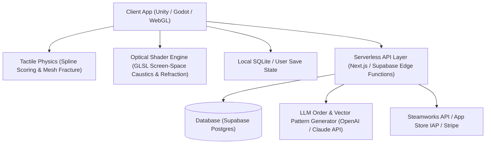

# 🏗️ Technical Architecture Blueprint: LuminaGlass AI

**Status**: APPROVED (7/7 Proofs Passed)  
**Target MVP Build Time**: 10–12 Days (Solopreneur Execution)  
**Primary Execution Stack**: Unity / Godot Engine (C# / GDScript) or WebGL (Three.js / GLSL Shaders) + Supabase (Cloud Gallery & Auth) + Stripe / Steamworks

---

## 1. System Architecture Overview



---

## 2. Database Schema (Postgres / Supabase SQL DDL)

```sql
-- Core User Profile & Save State Table
CREATE TABLE public.profiles (
    id UUID PRIMARY KEY REFERENCES auth.users(id) ON DELETE CASCADE,
    username TEXT NOT NULL,
    shop_coins INT DEFAULT 100,
    unlocked_tools JSONB DEFAULT '["basic_cutter", "copper_tape_5mm", "standard_iron"]'::jsonb,
    created_at TIMESTAMPTZ DEFAULT NOW()
);

-- Player Created Stained Glass Artworks Table
CREATE TABLE public.artworks (
    id UUID PRIMARY KEY DEFAULT gen_random_uuid(),
    user_id UUID REFERENCES public.profiles(id) ON DELETE CASCADE,
    title TEXT NOT NULL,
    vector_paths JSONB NOT NULL, -- Array of glass piece spline polygons & color RGBA
    solder_lines JSONB NOT NULL,  -- Extruded solder border paths & width
    caustic_preset TEXT DEFAULT 'sunny_afternoon',
    is_public BOOLEAN DEFAULT true,
    likes_count INT DEFAULT 0,
    created_at TIMESTAMPTZ DEFAULT NOW()
);

-- Client Orders & Shop Campaign Progress Table
CREATE TABLE public.shop_orders (
    id UUID PRIMARY KEY DEFAULT gen_random_uuid(),
    order_code TEXT UNIQUE NOT NULL,
    client_name TEXT NOT NULL,
    story_text TEXT NOT NULL,
    pattern_template JSONB NOT NULL,
    reward_coins INT NOT NULL,
    difficulty INT DEFAULT 1
);
```

---

## 3. Core API Endpoints & Contract Specs

| Endpoint | Method | Input Payload | Output Response | Purpose |
|---|---|---|---|---|
| `/api/v1/pattern/generate` | POST | `{ "prompt": "monstera leaf in gothic frame" }` | `{ "svg_paths": [...], "color_palette": [...] }` | Generates vector score lines from text prompt |
| `/api/v1/orders/next` | GET | `?user_id=123` | `{ "order_id": "...", "client_name": "Clara", "request": "..." }` | Fetches next cozy shop client order |
| `/api/v1/artworks/publish` | POST | `{ "title": "Moonlight Fox", "data": {...} }` | `{ "status": "success", "artwork_id": "..." }` | Publishes artwork to global community gallery |

---

## 4. UI/UX Layout Tokens & Screen Hierarchy

- **Screen 1**: Cozy Craft Workshop HUD (Toolbench with cutter, grinding wheel, copper foil roll, soldering iron, and glass sheet rack)
- **Screen 2**: Interactive Glass Workbench (Touch/mouse drag scoring, tactile tap-to-snap, solder melting loop)
- **Screen 3**: Window Light Test & Caustics Display (Place finished piece in wooden window frame, adjust sun angle, toggle desk clock overlay)
- **Screen 4**: Client Order Desk & Community Gallery (Review customer letters, collect coins, unlock vintage glass textures)
- **Color Palette Tokens**:
  - Warm Wood Workbench: `#3D2612`
  - Amber Sunbeam Glow: `#F59E0B`
  - Copper Tape Accent: `#B45309`
  - Lead-Free Solder Silver: `#E2E8F0`
  - Deep Cathedral Blue: `#1E3A8A`

---

## 5. Solopreneur MVP Implementation Roadmap (Day 1 - Day 14)

- **Day 1–3**: Core Mechanics Engine — Spline glass scoring path algorithm, mesh splitting on score lines, and tactile snapping audio/visual feedback.
- **Day 4–6**: Copper foiling border generator & Soldering iron vertex-extrusion path with melting metal particle effect.
- **Day 7–8**: Real-time GLSL screen-space caustics shader & dynamic sunbeam light ray projection.
- **Day 9–10**: Cozy Shop Order loop (40 handcrafted client orders + AI procedural order generator) & background lofi audio engine.
- **Day 11–12**: Desk Light Companion Mode (Fullscreen interactive window clock & ambient soundscape) + UI layout.
- **Day 13–14**: App Store / Steam Build creation, zero-CAC TikTok/Shorts ASMR demo recording, and launch release.
