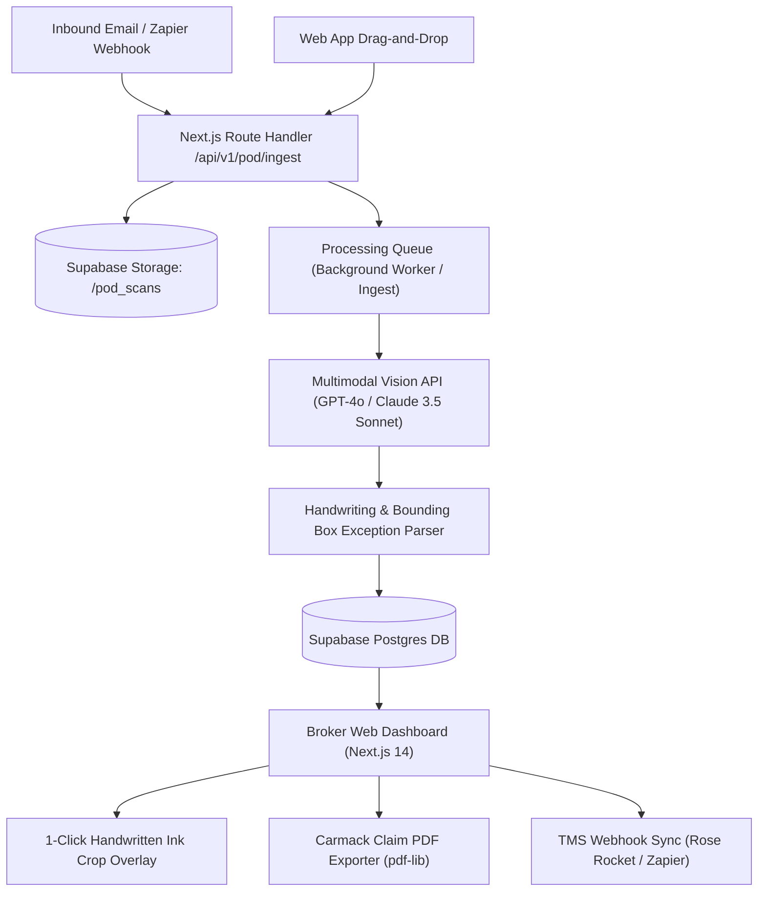

# 🏗️ Technical Architecture Blueprint: PODGuard AI

**Status**: APPROVED (7/7 Proofs Passed)  
**Target MVP Build Time**: 6–8 Days (Solopreneur Stack)  
**Primary Execution Stack**: Next.js 14 (App Router) + Tailwind CSS + Supabase (Postgres + Storage + Auth) + OpenAI GPT-4o / Claude 3.5 Sonnet Vision API + `pdf-lib` + Stripe  

---

## 1. System Architecture Overview



---

## 2. Database Schema (Postgres / Supabase SQL DDL)

```sql
-- Enable UUID extension
CREATE EXTENSION IF NOT EXISTS "uuid-ossp";

-- Core Broker Organization Table
CREATE TABLE public.organizations (
    id UUID PRIMARY KEY DEFAULT gen_random_uuid(),
    name TEXT NOT NULL,
    owner_id UUID NOT NULL,
    subscription_tier TEXT NOT NULL DEFAULT 'starter', -- 'starter', 'pro', 'scale'
    stripe_customer_id TEXT,
    stripe_subscription_id TEXT,
    created_at TIMESTAMPTZ NOT NULL DEFAULT NOW()
);

-- Users / Brokers Table
CREATE TABLE public.profiles (
    id UUID PRIMARY KEY REFERENCES auth.users(id) ON DELETE CASCADE,
    org_id UUID REFERENCES public.organizations(id) ON DELETE CASCADE,
    email TEXT NOT NULL,
    full_name TEXT,
    role TEXT NOT NULL DEFAULT 'broker', -- 'admin', 'broker'
    created_at TIMESTAMPTZ NOT NULL DEFAULT NOW()
);

-- Ingested POD Documents Table
CREATE TABLE public.pod_documents (
    id UUID PRIMARY KEY DEFAULT gen_random_uuid(),
    org_id UUID NOT NULL REFERENCES public.organizations(id) ON DELETE CASCADE,
    load_number TEXT,
    carrier_name TEXT,
    consignee_name TEXT,
    file_path TEXT NOT NULL,
    file_name TEXT NOT NULL,
    document_type TEXT DEFAULT 'POD', -- 'POD', 'BOL', 'LUMPER', 'OTHER'
    status TEXT NOT NULL DEFAULT 'processing', -- 'processing', 'clean', 'exception_flagged', 'reviewed'
    has_handwriting_exception BOOLEAN DEFAULT FALSE,
    exception_notes TEXT,
    confidence_score NUMERIC(5,2), -- 0.00 to 100.00
    bounding_boxes JSONB DEFAULT '[]'::jsonb, -- Spatial coordinates for ink crops
    raw_ai_analysis JSONB DEFAULT '{}'::jsonb,
    created_at TIMESTAMPTZ NOT NULL DEFAULT NOW(),
    updated_at TIMESTAMPTZ NOT NULL DEFAULT NOW()
);

-- Indexes for lightning fast queries
CREATE INDEX idx_pod_docs_org_status ON public.pod_documents (org_id, status);
CREATE INDEX idx_pod_docs_load_number ON public.pod_documents (org_id, load_number);
```

---

## 3. Core API Endpoints & Contract Specs

| Endpoint | Method | Input Payload | Output Response | Purpose |
|---|---|---|---|---|
| `/api/v1/pod/ingest` | POST | `multipart/form-data` (file, load_number) or JSON with `file_url` | `{ "status": "success", "pod_id": "uuid", "processing": true }` | Primary document ingestion via Web UI or Zapier webhook |
| `/api/v1/pod/analyze` | POST | `{ "pod_id": "uuid" }` | `{ "status": "analyzed", "has_exception": true, "notes": "3 pallets short", "boxes": [...] }` | Vision LLM extraction pipeline handler |
| `/api/v1/claim/export` | POST | `{ "pod_id": "uuid", "claim_amount": 850.00, "description": "Damaged goods" }` | Binary PDF Download (`application/pdf`) | Generates Carmack Amendment Freight Claim PDF packet |
| `/api/v1/webhooks/stripe` | POST | Stripe Event Payload | `{ "received": true }` | Handles subscription creation, renewal, and quota sync |

---

## 4. UI/UX Layout Tokens & Screen Hierarchy

### Screen Hierarchy
1. **Screen 1: Operations HUD & Live Feed**
   - Summary statistics cards: "Total Processed Today", "Clean PODs (Auto-Approved)", "Exceptions Needing Review".
   - Search & Filter bar (Filter by Load #, Carrier, Date, Exception Status).
2. **Screen 2: POD Detail & Handwritten Exception Reviewer**
   - Side-by-side view: High-res PDF viewer on left; AI Extraction Panel on right.
   - **Handwritten Ink Snippet Crop Card**: Zoomed-in visual crop of scribbled notes with confidence score badge (`98% Confidence: "Refused 2 cases crushed"`).
   - 1-Tap Action Buttons: `[Confirm Exception & Hold Payment]`, `[Mark as False Positive / Clean]`, `[Generate Claim Packet]`.
3. **Screen 3: Settings & Integrations**
   - Inbound Email Address forwarding key (`your-brokerage@inbound.podguard.ai`).
   - Zapier / TMS API Webhook configuration & Stripe Subscription management.

### Design System & Color Tokens
- **Background**: `#0F172A` (Slate 900) & `#1E293B` (Slate 800)
- **Primary Accent**: `#2563EB` (Royal Blue)
- **Exception Warning / Danger**: `#EF4444` (Crimson)
- **Clean / Verified Accent**: `#10B981` (Emerald Green)
- **Typography**: Inter / System Sans-Serif font

---

## 5. Solopreneur MVP Implementation Roadmap (Day 1 - Day 8)

- **Day 1–2: Project Foundation & Supabase Setup**
  - Next.js 14 (App Router) setup with Tailwind CSS and Lucide Icons.
  - Supabase Auth & Database schema creation (`organizations`, `profiles`, `pod_documents`).
  - Supabase Storage bucket configuration with RLS rules.
- **Day 3–4: Vision LLM Processing Engine**
  - Implement `/api/v1/pod/ingest` and `/api/v1/pod/analyze` route handlers.
  - Multi-prompt LLM vision pipeline: detect document type, extract load #, classify clean vs. handwritten ink exceptions, return spatial bounding box coordinates.
  - Image cropping utility to generate visual snippet crops of handwritten text.
- **Day 5: Web Dashboard & Review UI**
  - Build Operations HUD, PDF viewer, side-by-side exception panel, and 1-click review action states.
- **Day 6: Carmack Claim Exporter & Inbound Email Processing**
  - Implement `pdf-lib` document generator for 1-click Carmack Amendment claim packages.
  - Connect Postmark / Resend inbound email webhook parser to auto-create POD documents from email PDF attachments.
- **Day 7: Stripe Subscriptions & Zapier Integration**
  - Integrate Stripe Checkout & Customer Portal (`starter`, `pro`, `scale` tiers).
  - Expose inbound/outbound webhooks for Zapier integration.
- **Day 8: Verification & Launch**
  - E2E test with degraded/crumpled POD sample images with real scribbled handwriting notes.
  - Deploy to Vercel, record Product Hunt & TikTok demonstration video, publish documentation.
