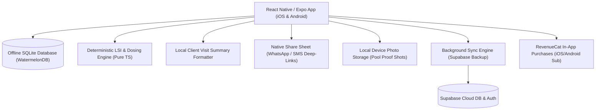

# 🏗️ Technical Architecture Blueprint: PoolTech AI

**Status**: APPROVED (6/6 Proofs Passed)  
**Target MVP Build Time**: 5–7 Days  
**Primary Execution Stack**: React Native / Expo (iOS & Android) + Expo SQLite + WatermelonDB + Native Share Sheet + Local Deterministic LSI Engine

---

## 1. System Architecture Overview



---

## 2. Database Schema (SQLite & Supabase SQL DDL)

```sql
-- Profiles & Technician Table
CREATE TABLE public.technicians (
    id UUID PRIMARY KEY DEFAULT gen_random_uuid(),
    email TEXT UNIQUE NOT NULL,
    company_name TEXT NOT NULL,
    phone TEXT,
    subscription_tier TEXT DEFAULT 'trial',
    created_at TIMESTAMPTZ DEFAULT NOW()
);

-- Clients / Route Stops Table
CREATE TABLE public.route_clients (
    id UUID PRIMARY KEY DEFAULT gen_random_uuid(),
    tech_id UUID REFERENCES public.technicians(id) ON DELETE CASCADE,
    client_name TEXT NOT NULL,
    address TEXT NOT NULL,
    phone_number TEXT NOT NULL,
    gate_code TEXT,
    pool_gallons INTEGER NOT NULL DEFAULT 15000,
    surface_type TEXT NOT NULL DEFAULT 'plaster', -- plaster, quartz, pebble, vinyl, fiberglass
    target_ph NUMERIC(3,2) DEFAULT 7.4,
    target_fc NUMERIC(3,2) DEFAULT 3.0,
    created_at TIMESTAMPTZ DEFAULT NOW()
);

-- Chemical Log & Visit Receipts Table
CREATE TABLE public.visit_logs (
    id UUID PRIMARY KEY DEFAULT gen_random_uuid(),
    client_id UUID REFERENCES public.route_clients(id) ON DELETE CASCADE,
    ph NUMERIC(3,2) NOT NULL,
    free_chlorine NUMERIC(3,2) NOT NULL,
    total_alkalinity INTEGER NOT NULL,
    cyanuric_acid INTEGER NOT NULL,
    calcium_hardness INTEGER NOT NULL,
    water_temp_f INTEGER NOT NULL DEFAULT 78,
    lsi_index NUMERIC(3,2) NOT NULL,
    liquid_chlorine_added_oz INTEGER DEFAULT 0,
    muriatic_acid_added_oz INTEGER DEFAULT 0,
    dry_acid_added_lbs NUMERIC(4,2) DEFAULT 0,
    baking_soda_added_lbs NUMERIC(4,2) DEFAULT 0,
    notes TEXT,
    photo_uri TEXT,
    dispatch_status TEXT DEFAULT 'sent', -- sent, pending, skipped
    created_at TIMESTAMPTZ DEFAULT NOW()
);
```

---

## 3. Core API Endpoints & Contract Specs

| Endpoint | Method | Input Payload | Output Response | Purpose |
|---|---|---|---|---|
| `Local TS Pure Function` | Internal | `{ ph, fc, ta, cya, ch, temp, gallons, surface }` | `{ lsi, chemical_doses: {}, status: 'balanced' }` | Instant sub-1ms LSI chemical calculation |
| `Local Text Engine` | Internal | `{ client_name, doses, photo_uri, date }` | `{ formatted_sms_text, whatsapp_url }` | Generates 1-tap client visit report text |
| `/api/v1/sync` | POST | `{ pending_logs: [] }` | `{ synced_ids: [], status: 'ok' }` | Background cloud backup when online |
| `/api/v1/webhooks/revenuecat` | POST | RevenueCat Event Payload | `{ received: true }` | In-App Subscription entitlement sync |

---

## 4. UI/UX Layout Tokens & Screen Hierarchy

- **Screen 1: Route Dashboard & Today's Stop List**: List of client pools ordered by route sequence, gate code chip, phone status badge.
- **Screen 2: 15-Second Test Input & Dosing HUD**: Interactive numerical sliders (pH, FC, TA, CYA, Temp), live LSI gauge (Color range: Blue = Corrosive, Green = Balanced, Red = Scaling), instant dosage breakdown chips.
- **Screen 3: 1-Tap Visit Summary & Dispatch Modal**: Instant camera snap of sparkling pool, auto-generated summary message, big 1-tap buttons: "Send via WhatsApp", "Send via iMessage/SMS", "Complete Stop".
- **Color Palette Tokens**:
  - Primary Water Blue: `#0284C7` (Sky 600)
  - Balanced Green: `#10B981` (Emerald 500)
  - Corrosive Blue Warning: `#3B82F6` (Blue 500)
  - Scaling Red Warning: `#EF4444` (Red 500)
  - Dark HUD Background: `#0F172A` (Slate 900)

---

## 5. Solopreneur MVP Implementation Roadmap (Day 1 - Day 7)

- **Day 1**: Local Deterministic LSI Calculation Engine (Pure TypeScript) + Unit Tests for chemical dosage formulas.
- **Day 2**: Expo SQLite / WatermelonDB schema setup for Route Clients & Visit Logs (100% offline-first).
- **Day 3**: UI Layout — Route List & 15-Second Test HUD with LSI Gauge UI.
- **Day 4**: Native Camera integration & Local Visit Summary text generator.
- **Day 5**: Native Share Sheet integration (WhatsApp deep-links & SMS share intents).
- **Day 6**: RevenueCat In-App Purchases setup ($14.99/mo paywall after 14-day trial).
- **Day 7**: End-to-end device testing, TestFlight / Google Play Internal Track submission.
