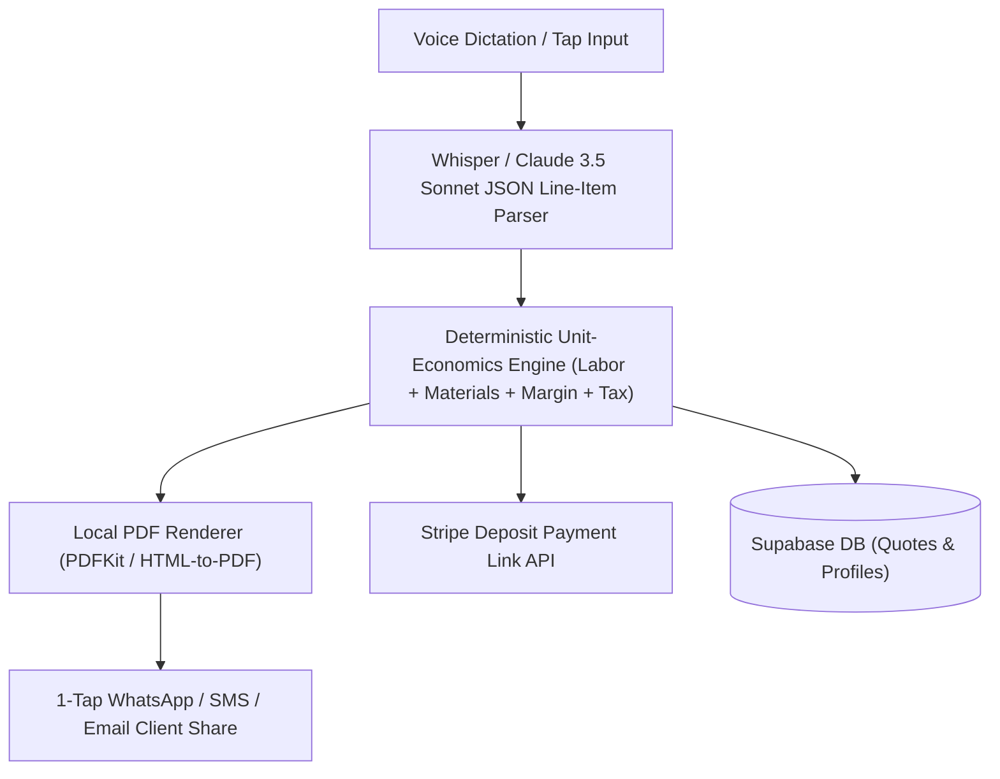

# 🏗️ Technical Architecture Blueprint: QuickQuote AI

**Status**: APPROVED (6/6 Proofs Passed)  
**Target MVP Build Time**: 2 Weeks (Solo Builder + AI Tools)  
**Primary Execution Stack**: React Native / Flutter + Supabase + Stripe API + Whisper / Claude API

---

## 1. System Architecture Overview



---

## 2. Database Schema (Supabase / Postgres SQL DDL)

```sql
-- Contractor Profiles
CREATE TABLE public.contractor_profiles (
    id UUID PRIMARY KEY REFERENCES auth.users(id) ON DELETE CASCADE,
    business_name TEXT NOT NULL,
    trade_category TEXT, -- Plumbing, Electrical, Painting, etc.
    default_hourly_rate NUMERIC(10,2) DEFAULT 75.00,
    default_margin_pct NUMERIC(5,2) DEFAULT 20.00,
    logo_url TEXT,
    created_at TIMESTAMPTZ DEFAULT NOW()
);

-- Quotes Table
CREATE TABLE public.quotes (
    id UUID PRIMARY KEY DEFAULT gen_random_uuid(),
    contractor_id UUID REFERENCES public.contractor_profiles(id) ON DELETE CASCADE,
    client_name TEXT NOT NULL,
    client_phone TEXT,
    items JSONB DEFAULT '[]'::jsonb, -- Array of { description, qty, unit_price, total }
    subtotal NUMERIC(10,2) NOT NULL,
    tax_amount NUMERIC(10,2) DEFAULT 0.00,
    total_amount NUMERIC(10,2) NOT NULL,
    deposit_amount NUMERIC(10,2) DEFAULT 0.00,
    stripe_payment_link TEXT,
    pdf_url TEXT,
    status TEXT DEFAULT 'sent', -- draft, sent, accepted, paid
    created_at TIMESTAMPTZ DEFAULT NOW()
);
```

---

## 3. Core API Endpoints & Contract Specs

| Endpoint | Method | Input Payload | Output Response | Purpose |
|---|---|---|---|---|
| `/api/v1/quotes/parse-voice` | POST | `{ "audio_base64": "..." }` | `{ "items": [...], "client_name": "..." }` | Voice Dictation to Line Items |
| `/api/v1/quotes/generate-pdf` | POST | `{ "quote_id": "..." }` | `{ "pdf_url": "https://..." }` | 1-Tap PDF Rendering |
| `/api/v1/stripe/create-link` | POST | `{ "quote_id": "...", "amount": 10000 }` | `{ "payment_url": "https://buy.stripe.com/..." }` | Create Deposit Link |

---

## 4. UI/UX Layout Tokens & Screen Hierarchy

- **Screen 1**: Instant Quote HUD (Big Voice Dictation Button + Fast Line-Item Table)
- **Screen 2**: PDF Preview & Stripe Deposit Link Switcher
- **Screen 3**: Client Share Sheet (Direct WhatsApp / SMS / Email)
- **Color Tokens**: Navy `#0F172A` (Header), Emerald `#10B981` (Primary CTA), Slate `#F8FAFC` (Card Background)

---

## 5. Solopreneur MVP Implementation Roadmap (Day 1 - Day 14)

- **Day 1–3**: Voice-to-JSON line-item parsing prompt + unit-economics calculation engine.
- **Day 4–7**: PDF rendering engine & 1-tap WhatsApp sharing integration.
- **Day 8–10**: Supabase DB schemas & Stripe Payment Link API integration.
- **Day 11–14**: App Store submission & Reddit trade community outreach.
