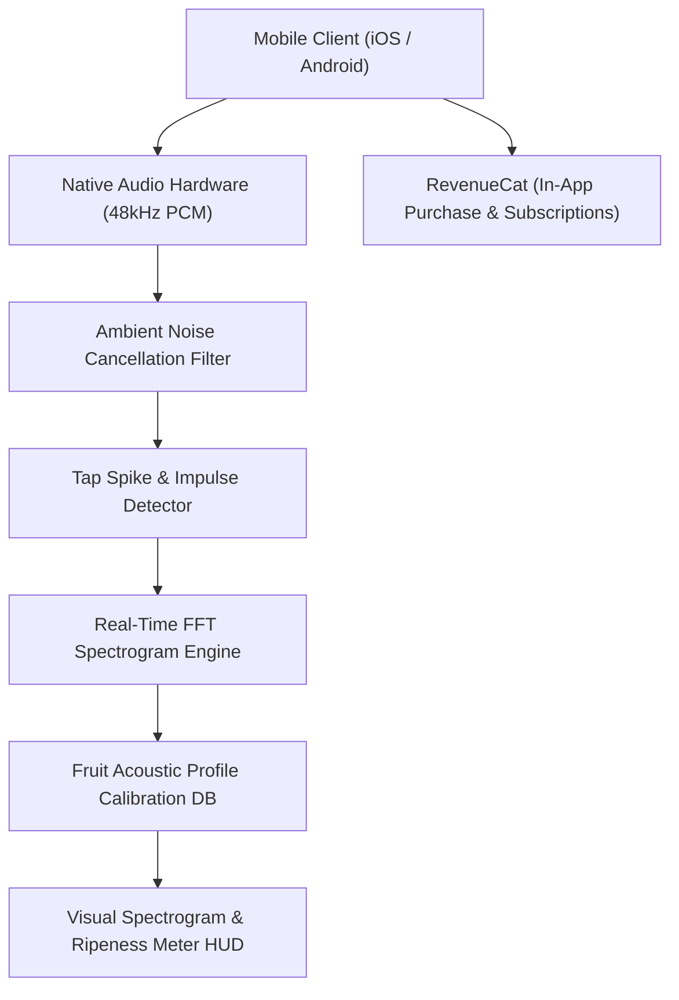

# 🏗️ Technical Architecture Blueprint: RipeTap AI

**Status**: APPROVED (6/6 Proofs Passed)  
**Target MVP Build Time**: 5–7 Days (Solopreneur Execution)  
**Primary Execution Stack**: React Native / Flutter (or Native Swift / Kotlin) + Native Audio DSP (FFT) + RevenueCat (In-App Purchases)

---

## 1. System Architecture Overview



---

## 2. Database & Local Storage Schema (SQLite / AsyncStorage Specs)

```sql
-- Local Scan History Table
CREATE TABLE IF NOT EXISTS scan_history (
    id TEXT PRIMARY KEY,
    fruit_type TEXT NOT NULL, -- 'watermelon', 'cantaloupe', 'honeydew', 'pineapple', 'avocado'
    dominant_frequency_hz REAL NOT NULL,
    damping_factor_q REAL NOT NULL,
    ripeness_score INTEGER NOT NULL, -- 0 to 100
    ripeness_label TEXT NOT NULL, -- 'Unripe', 'Optimal Ripe', 'Overripe'
    created_at TIMESTAMP DEFAULT CURRENT_TIMESTAMP
);

-- Calibrated Fruit Acoustic Reference Profiles
CREATE TABLE IF NOT EXISTS fruit_acoustic_profiles (
    fruit_id TEXT PRIMARY KEY,
    name TEXT NOT NULL,
    unripe_freq_min REAL NOT NULL,
    unripe_freq_max REAL NOT NULL,
    ripe_freq_min REAL NOT NULL,
    ripe_freq_max REAL NOT NULL,
    overripe_freq_min REAL NOT NULL,
    overripe_freq_max REAL NOT NULL
);
```

---

## 3. Core API & Processing Pipeline Specs

| Module / Pipeline Step | Processing Mode | Input Data | Output / Result | Purpose |
|---|---|---|---|---|
| `AudioStreamManager` | Native Local (PCM 48kHz) | Mic Stream | Float32 Array Buffer | Capture tap acoustic impulse sound |
| `ImpulseSpikeTrigger` | Local DSP | Raw PCM Buffer | Tap Event Timestamp & Window | Isolate tap knock sound from background supermarket noise |
| `FFTResonanceEngine` | Local Math / DSP | 2048-point Window | Frequency Spectrum & $F_0$ Peak (Hz) | Calculate fundamental resonant harmonic frequency |
| `RipenessClassifier` | Local Rule / Profile | $F_0$ Peak + Fruit Type | Ripeness Rating (0-100%) + Audio Visualizer | Determine if fruit internal structure is hollow/ripe |

---

## 4. UI/UX Layout Tokens & Screen Hierarchy

- **Screen 1: Main Inspection HUD (Camera + Spectrogram Overlay)**
  - Fullscreen Camera View finder with fruit targeting reticle.
  - Live Audio Waveform HUD at bottom showing acoustic tap impulses.
  - Fruit Selection Carousel (Watermelon 🍉, Cantaloupe 🍈, Pineapple 🍍, Avocado 🥑).
- **Screen 2: Scan Result Modal**
  - Big Vibrant Dial/Gauge: **94% RIPE - PERFECT JUICINESS** (Emerald Green `#10B981`).
  - Frequency Spectrum breakdown graph ($F_0 = 138 \text{ Hz}$, Deep Resonance).
  - Quick 1-Tap Share Button ("Share Viral Clip to TikTok / Instagram").
- **Screen 3: Scan History & Saved Gems**
  - Cards listing past grocery inspection scans with dates and ratings.
- **Color Palette Tokens**:
  - Primary Accent: `#10B981` (Fresh Emerald Green)
  - Warning/Unripe: `#F59E0B` (Amber Yellow)
  - Dark Theme Background: `#090D16` (Deep Midnight Slate)
  - Card/HUD Surface: `#1E293B` (Slate 800 with 80% backdrop blur glassmorphism)

---

## 5. Solopreneur MVP Implementation Roadmap (Day 1 - Day 7)

- **Day 1**: Initialize Flutter/React Native app, configure 48kHz PCM audio recording permissions & AVFoundation / AudioRecord hooks.
- **Day 2**: Implement FFT (Fast Fourier Transform) math engine & transient spike detector to isolate knock sound transients in <50ms.
- **Day 3**: Build fruit acoustic profile calibration logic ($F_0$ resonance thresholds for Watermelon, Cantaloupe, Pineapple) and offline SQLite storage.
- **Day 4**: Design modern HUD UI with live waveform visualizer, smooth gauge animations, and glassmorphic card overlays.
- **Day 5**: Integrate RevenueCat for paywall ($2.99 lifetime unlock / $0.99 monthly) with 3 free daily test taps.
- **Day 6**: Test in real grocery environment (Costco / Trader Joe's) to fine-tune ambient noise filter & transient threshold.
- **Day 7**: Record 10-second viral TikTok demo video, generate App Store screenshots, and submit to App Store & Google Play.
