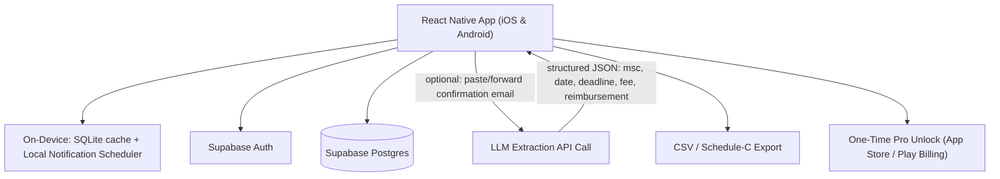

# 🏗️ Technical Architecture Blueprint: ShopTally

**Status**: APPROVED (7/7 Proofs Passed)
**Target MVP Build Time**: 9–11 Days (5–6 days core CRUD/UI + 2–3 days AI extraction + 2 days auth/sync/launch)
**Primary Execution Stack**: React Native (Expo) + Supabase (Postgres/Auth) + Expo Local Notifications + Hosted LLM API (optional extraction layer)

---

## 1. System Architecture Overview



---

## 2. Database Schema (Postgres / Supabase SQL DDL)

```sql
-- Core User Profile Table
CREATE TABLE public.profiles (
    id UUID PRIMARY KEY REFERENCES auth.users(id) ON DELETE CASCADE,
    email TEXT NOT NULL,
    subscription_tier TEXT DEFAULT 'free', -- 'free' | 'pro'
    created_at TIMESTAMPTZ DEFAULT NOW()
);

-- Mystery Shopping Companies the user works with
CREATE TABLE public.msc_companies (
    id UUID PRIMARY KEY DEFAULT gen_random_uuid(),
    user_id UUID REFERENCES public.profiles(id) ON DELETE CASCADE,
    name TEXT NOT NULL,
    portal_url TEXT,
    created_at TIMESTAMPTZ DEFAULT NOW()
);

-- Core Shop Assignment Ledger
CREATE TABLE public.shops (
    id UUID PRIMARY KEY DEFAULT gen_random_uuid(),
    user_id UUID REFERENCES public.profiles(id) ON DELETE CASCADE,
    msc_id UUID REFERENCES public.msc_companies(id) ON DELETE SET NULL,
    client_name TEXT,
    shop_date DATE NOT NULL,
    report_deadline TIMESTAMPTZ NOT NULL,
    fee_cents INTEGER NOT NULL DEFAULT 0,
    reimbursement_cents INTEGER NOT NULL DEFAULT 0,
    bonus_cents INTEGER NOT NULL DEFAULT 0,
    mileage NUMERIC(6,1) DEFAULT 0,
    status TEXT NOT NULL DEFAULT 'scheduled', -- scheduled | submitted | approved | rejected | paid
    notes TEXT,
    source TEXT DEFAULT 'manual', -- 'manual' | 'ai_extracted'
    created_at TIMESTAMPTZ DEFAULT NOW(),
    updated_at TIMESTAMPTZ DEFAULT NOW()
);

CREATE INDEX idx_shops_user_deadline ON public.shops(user_id, report_deadline);
CREATE INDEX idx_shops_user_status ON public.shops(user_id, status);
```

---

## 3. Core API Endpoints & Data Contracts

| Endpoint | Method | Input Payload | Output Response | Purpose |
|---|---|---|---|---|
| `/api/v1/shops` | POST | `{ msc_id, client_name, shop_date, report_deadline, fee_cents, reimbursement_cents, status }` | `{ shop: {...} }` | Create a shop entry (manual or post-AI-review) |
| `/api/v1/shops/summary` | GET | `?status=scheduled,submitted` | `{ total_pending_cents, total_paid_cents, count_by_msc: [...] }` | Cross-company dashboard totals |
| `/api/v1/extract` | POST | `{ raw_text: "forwarded confirmation email..." }` | `{ msc_guess, shop_date, report_deadline, fee_cents, reimbursement_cents, confidence }` | LLM parses unstructured MSC email/text into draft fields for user review — never auto-saves |
| `/api/v1/export/csv` | GET | `?year=2026` | CSV file (Schedule-C-ready columns) | Tax-season export |

---

## 4. UI/UX Screen Hierarchy & Color Tokens

- **Screen 1**: Onboarding — add your first 1–3 MSCs (name only, no OAuth/portal login required)
- **Screen 2**: Dashboard — "Total Owed" hero number, upcoming-deadline list sorted soonest-first, red badge on anything due <48h
- **Screen 3**: Add Shop — manual form (default) with a "Paste confirmation email" alternate action that routes through `/api/v1/extract` and pre-fills the same form for review/edit before save
- **Screen 4**: Shop Detail — status stepper (Scheduled → Submitted → Approved → Paid), edit fields, delete
- **Screen 5**: Export — date range picker → CSV download/share sheet
- **Color Palette Tokens**: Primary `#2563EB` (Blue 600, trust/finance-adjacent without implying a bank), Success `#16A34A` (paid/approved), Warning `#D97706` (deadline <48h), Neutral background `#F8FAFC` / Dark mode `#0F172A`

---

## 5. Solopreneur MVP Implementation Roadmap (Day 1 – Day 11)

- **Day 1–2**: Core data model (`msc_companies`, `shops`) + local SQLite cache + manual Add/Edit Shop form — ordinary CRUD.
- **Day 3–4**: Dashboard totals logic (pending/paid aggregation across MSCs) + status stepper UI — ordinary CRUD.
- **Day 5–6**: Local push notification scheduling tied to `report_deadline` (48h and 12h warnings) + notification permission flow — ordinary mobile-platform work, no novel signal processing.
- **Day 7–8 (AI component, scoped separately per Proof 7)**: Build `/api/v1/extract` LLM call + prompt, test against a real sample set of 10–15 distinct MSC confirmation email formats gathered from forum/community examples, build the "review before save" correction UI for parse misses.
- **Day 9**: Supabase Auth + sync, CSV export endpoint.
- **Day 10–11**: One-time Pro unlock (App Store/Play Billing), App Store/Play Store listing assets, soft-launch post in Mystery Shop Forum / mystery-shopper Facebook groups answering the exact "what would you want in an app" thread that surfaced this idea.
