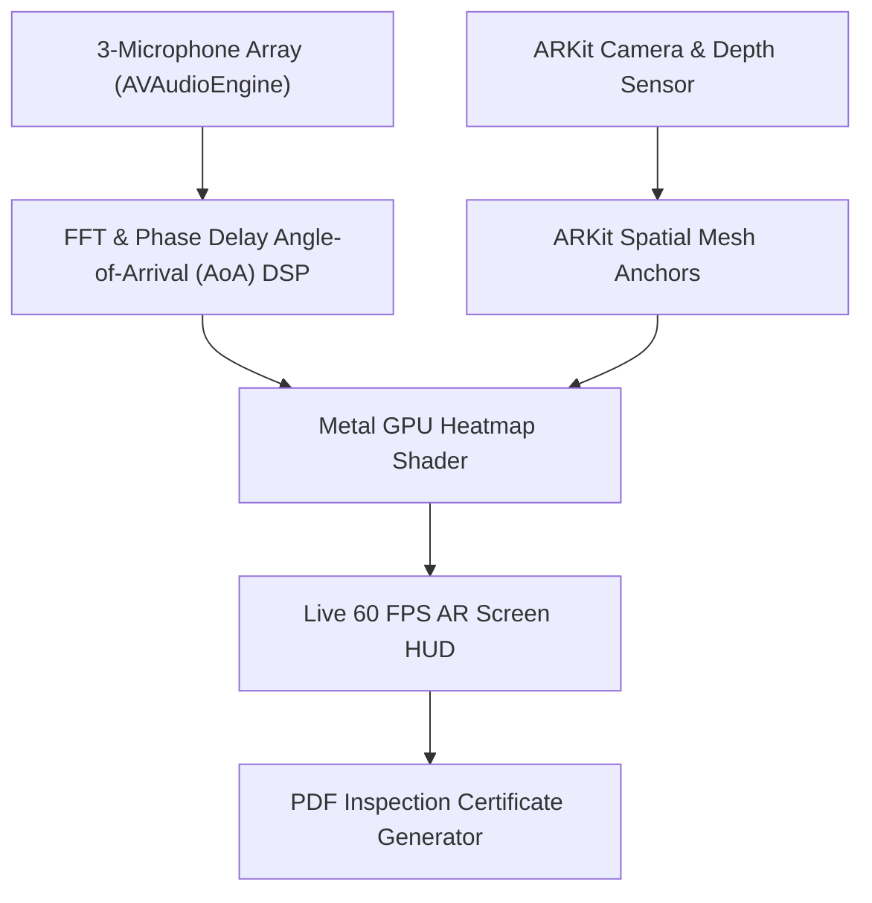

# 🏗️ Technical Architecture Blueprint: SoundFix AI

**Status**: APPROVED (6/6 Proofs Passed)  
**Target MVP Build Time**: 3 Weeks (Solo Builder + AI Tools)  
**Primary Execution Stack**: Swift / iOS Native (AVAudioEngine + ARKit + Metal Shaders) / Supabase

---

## 1. System Architecture Overview



---

## 2. Database Schema (Supabase / Postgres SQL DDL)

```sql
-- User Profiles
CREATE TABLE public.contractor_profiles (
    id UUID PRIMARY KEY REFERENCES auth.users(id) ON DELETE CASCADE,
    business_name TEXT,
    license_number TEXT,
    plan_tier TEXT DEFAULT 'pro_contractor',
    created_at TIMESTAMPTZ DEFAULT NOW()
);

-- Inspection Reports Table
CREATE TABLE public.inspection_reports (
    id UUID PRIMARY KEY DEFAULT gen_random_uuid(),
    contractor_id UUID REFERENCES public.contractor_profiles(id) ON DELETE CASCADE,
    client_name TEXT NOT NULL,
    property_address TEXT,
    dominant_frequency_hz INT,
    max_decibel_leak NUMERIC(5,2),
    heat_map_snapshot_url TEXT,
    pdf_certificate_url TEXT,
    created_at TIMESTAMPTZ DEFAULT NOW()
);
```

---

## 3. Core API Endpoints & Contract Specs

| Endpoint | Method | Input Payload | Output Response | Purpose |
|---|---|---|---|---|
| `/api/v1/certificates/generate` | POST | `{ "report_id": "...", "metrics": {} }` | `{ "pdf_url": "https://..." }` | Generate 1-Tap PDF Report |
| `/api/v1/subscriptions/stripe` | POST | Stripe Webhook Event | `{ "received": true }` | Pro Pass Subscription Sync |

---

## 4. UI/UX Layout Tokens & Screen Hierarchy

- **Screen 1**: Camera Authorization & Calibration HUD (Mic Array Test)
- **Screen 2**: Live 60 FPS AR Sound Heat-Map Viewport (Frequency Band Slider: 20Hz–20kHz)
- **Screen 3**: 1-Tap PDF Certificate Preview & Client Share Sheet
- **Color Tokens**: Dark Metal `#090D16` (Background), Heatmap Leak Gradient `#FF0055` (High Leak), `#00FFCC` (Sealed)

---

## 5. Solopreneur MVP Implementation Roadmap (Day 1 - Day 21)

- **Day 1–5**: Swift `AVAudioEngine` 3-mic phase delay AoA algorithm + Metal Shader heat-map overlay.
- **Day 6–10**: Integration with ARKit 3D mesh surface anchors for real-time tracking.
- **Day 11–15**: PDF Certificate auto-generator engine & local recording storage.
- **Day 16–18**: Supabase authentication, Pro Contractor subscription sync.
- **Day 19–21**: App Store TestFlight submission & TikTok/Shorts demo video recording.
