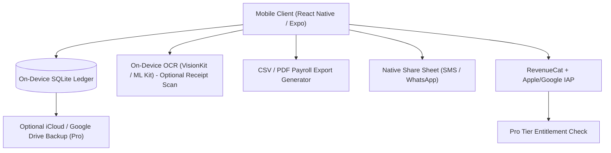

# 🏗️ Technical Architecture Blueprint: SplitShift

**Status**: APPROVED (6/6 Proofs Passed)
**Target MVP Build Time**: 1–2 Weeks
**Primary Execution Stack**: React Native (Expo) + SQLite (on-device, offline-first) + Apple VisionKit / Google ML Kit (optional OCR) + RevenueCat (IAP)

---

## 1. System Architecture Overview



SplitShift is deliberately **offline-first with no required backend** for the MVP — the entire split-calculation and ledger workflow runs on-device. This eliminates server costs, backend security surface, and any AI reliability risk in the money-math critical path. A backend is only introduced later (post-MVP) if multi-device sync across a management team becomes a validated Pro-tier request.

---

## 2. Database Schema (On-Device SQLite DDL)

```sql
-- Venue Table (supports multi-venue Pro tier)
CREATE TABLE venues (
    id TEXT PRIMARY KEY,       -- UUID
    name TEXT NOT NULL,
    default_split_template_id TEXT,
    created_at TEXT DEFAULT (datetime('now'))
);

-- Split Template Table (Equal / Role-% / Hours-Weighted / Points-Based)
CREATE TABLE split_templates (
    id TEXT PRIMARY KEY,
    venue_id TEXT REFERENCES venues(id) ON DELETE CASCADE,
    name TEXT NOT NULL,
    method TEXT NOT NULL CHECK (method IN ('equal', 'role_percent', 'hours_weighted', 'points')),
    created_at TEXT DEFAULT (datetime('now'))
);

CREATE TABLE split_template_roles (
    id TEXT PRIMARY KEY,
    template_id TEXT REFERENCES split_templates(id) ON DELETE CASCADE,
    role_name TEXT NOT NULL,       -- e.g. 'Bartender', 'Server', 'Busser'
    weight REAL NOT NULL DEFAULT 1.0  -- percentage or points multiplier depending on method
);

-- Shift Table (one row per calculated tip-out event)
CREATE TABLE shifts (
    id TEXT PRIMARY KEY,
    venue_id TEXT REFERENCES venues(id) ON DELETE CASCADE,
    template_id TEXT REFERENCES split_templates(id),
    shift_date TEXT NOT NULL,
    total_pooled_amount REAL NOT NULL,
    total_cash REAL DEFAULT 0,
    total_card REAL DEFAULT 0,
    source TEXT DEFAULT 'manual' CHECK (source IN ('manual', 'ocr_scan')),
    created_at TEXT DEFAULT (datetime('now'))
);

-- Staff Table (per-shift roster, not a persistent user account)
CREATE TABLE shift_staff (
    id TEXT PRIMARY KEY,
    shift_id TEXT REFERENCES shifts(id) ON DELETE CASCADE,
    staff_name TEXT NOT NULL,
    role_name TEXT NOT NULL,
    hours_worked REAL DEFAULT 0,
    calculated_payout REAL NOT NULL
);
```

---

## 3. Core "API" / Module Contracts (On-Device, No Network Required)

| Module Function | Input Payload | Output | Purpose |
|---|---|---|---|
| `calculateSplit(shift, roster, template)` | `{ totalAmount, staff[], method, weights }` | `{ staffPayouts: [{name, amount}], remainderCents }` | Deterministic split engine — pure function, unit-testable |
| `scanReceiptTotal(imageUri)` | Photo URI | `{ detectedTotal: number, confidence: number }` | Optional OCR autofill; always editable before calculation runs |
| `exportShiftCSV(shiftId)` | `shiftId` | CSV file blob | Payroll-ready export (Pro tier) |
| `shareBreakdown(shiftId)` | `shiftId` | Native share sheet payload (formatted text) | 1-tap SMS/WhatsApp team share |
| `checkProEntitlement()` | — | `{ isPro: boolean }` | RevenueCat entitlement gate for export/multi-venue/history |

---

## 4. UI/UX Layout Tokens & Screen Hierarchy

- **Screen 1**: Onboarding — pick venue name + default split method (Equal / Role-% / Hours-Weighted / Points)
- **Screen 2**: New Shift — enter total pooled tips (manual number pad, or "Scan Receipt" camera button)
- **Screen 3**: Roster — add staff for this shift (name, role, hours), reorder/remove
- **Screen 4**: Split Result — per-person payout breakdown, "Share via Text" button, "Save to Ledger"
- **Screen 5**: Ledger (Pro) — scrollable shift history per venue, tap-through to CSV export
- **Color Palette Tokens**: Primary `#0EA5E9` (Sky Blue — trust/clarity), Dark HUD `#111827` (Gray 900), Accent `#22C55E` (Green — money/payout confirmation), Warning `#F59E0B` (Amber — unbalanced/remainder flag)

---

## 5. Solopreneur MVP Implementation Roadmap (Day 1 – Day 14)

- **Day 1–3**: Core split-calculation engine (equal / role-% / hours-weighted / points methods) as pure, unit-tested functions; SQLite schema + local persistence layer.
- **Day 4–6**: UI build — New Shift, Roster, Split Result, and Ledger screens; native share-sheet integration.
- **Day 7–8**: RevenueCat + IAP wiring for Pro tier (unlimited history, CSV export, multi-venue); paywall screen.
- **Day 9–10**: Optional OCR receipt-scan feature (VisionKit/ML Kit) with manual-entry fallback and confidence display.
- **Day 11–12**: CSV export formatting for payroll-record use; App Store / Play Store listing copy targeting "tip pool calculator" / "tip out calculator" ASO terms.
- **Day 13–14**: TikTok/Reels launch clip recording (shift-lead POV using the app end-of-night), r/bartenders and r/TalesFromYourServer organic launch posts, submit to app stores.
