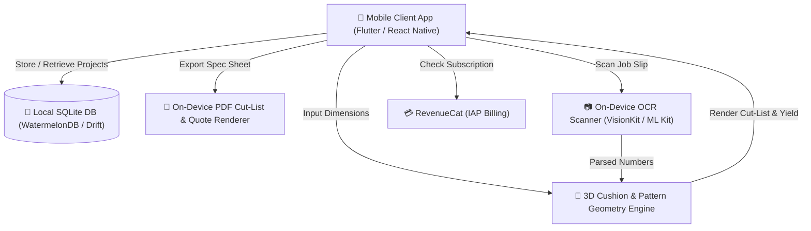

# 🏗️ Technical Architecture Blueprint: UpholsteryCut

**Status**: APPROVED (7/7 Proofs Passed)  
**Target MVP Build Time**: 7–9 Days  
**Primary Execution Stack**: Flutter / React Native + Local SQLite (WatermelonDB) + On-Device PDFKit + RevenueCat

---

## 1. System Architecture Overview



---

## 2. Database Schema (SQLite / Postgres DDL)

```sql
-- Projects Table
CREATE TABLE public.projects (
    id UUID PRIMARY KEY DEFAULT gen_random_uuid(),
    user_id UUID,
    client_name TEXT NOT NULL,
    project_type TEXT NOT NULL, -- 'sofa', 'chair', 'boat_bench', 'cushion_set'
    fabric_name TEXT,
    fabric_width_inches REAL DEFAULT 54.0,
    pattern_repeat_vertical_inches REAL DEFAULT 0.0,
    pattern_repeat_horizontal_inches REAL DEFAULT 0.0,
    total_yardage_required REAL DEFAULT 0.0,
    total_estimated_cost REAL DEFAULT 0.0,
    created_at TIMESTAMPTZ DEFAULT NOW(),
    updated_at TIMESTAMPTZ DEFAULT NOW()
);

-- Cushion Cut Items Table
CREATE TABLE public.cushion_items (
    id UUID PRIMARY KEY DEFAULT gen_random_uuid(),
    project_id UUID REFERENCES public.projects(id) ON DELETE CASCADE,
    cushion_label TEXT NOT NULL, -- e.g. "Seat Cushion #1", "Backrest Left"
    shape_type TEXT DEFAULT 'box_rectangle', -- 'box_rectangle', 't_cushion', 'trapezoid', 'l_shape'
    length_inches REAL NOT NULL,
    width_inches REAL NOT NULL,
    thickness_inches REAL NOT NULL,
    quantity INTEGER DEFAULT 1,
    has_welting_piping BOOLEAN DEFAULT TRUE,
    seam_allowance_inches REAL DEFAULT 0.75,
    foam_firmness_ild INTEGER DEFAULT 35, -- Indentation Load Deflection (e.g. 30=Medium, 35=Firm)
    calculated_top_plate_cut TEXT,
    calculated_boxing_strip_cut TEXT,
    calculated_piping_yardage REAL,
    created_at TIMESTAMPTZ DEFAULT NOW()
);
```

---

## 3. Core Engine Formulas & Data Contracts

### 3.1 3D Cushion Cut & Yardage Math Engine (TypeScript / Dart Contract)

```typescript
export interface CushionInput {
  lengthInches: number;
  widthInches: number;
  thicknessInches: number;
  quantity: number;
  hasWelting: boolean;
  seamAllowanceInches: number; // default 0.75"
  fabricWidthInches: number; // default 54"
  patternRepeatVInches: number; // 0 if solid
  patternRepeatHInches: number; // 0 if solid
}

export interface CutListResult {
  topBottomPlatesCut: { length: number; width: number; count: number };
  boxingStripsCut: { length: number; width: number; count: number };
  weltingCordYardage: number;
  zipperPlaqueCut: { length: number; width: number };
  totalSquareInches: number;
  totalLinearYards: number;
  wasteFactorPercent: number;
}

export function calculateCushionCut(input: CushionInput): CutListResult {
  const sa = input.seamAllowanceInches * 2;
  const plateL = input.lengthInches + sa;
  const plateW = input.widthInches + sa;
  const boxingW = input.thicknessInches + sa;
  const boxingL = (input.lengthInches + input.widthInches) * 2 + 4.0; // perimeter + overlap

  // Pattern repeat adjustment
  const effPlateL = input.patternRepeatVInches > 0 
    ? Math.ceil(plateL / input.patternRepeatVInches) * input.patternRepeatVInches 
    : plateL;

  // Welting cord (2 * perimeter per cushion)
  const weltingPerimeterInches = ((input.lengthInches + input.widthInches) * 2) * 2 * input.quantity;
  const weltingStripsYardage = (weltingPerimeterInches / 36) * 1.15; // 15% bias-cut waste factor

  const totalYards = ((effPlateL * plateW * 2 + boxingL * boxingW) * input.quantity / (54 * 36)) * 1.15 + (input.hasWelting ? weltingStripsYardage : 0);

  return {
    topBottomPlatesCut: { length: effPlateL, width: plateW, count: input.quantity * 2 },
    boxingStripsCut: { length: boxingL, width: boxingW, count: input.quantity },
    weltingCordYardage: Math.ceil(weltingStripsYardage * 10) / 10,
    zipperPlaqueCut: { length: input.widthInches + 4, width: boxingW + 1.5 },
    totalSquareInches: Math.round(totalYards * 54 * 36),
    totalLinearYards: Math.ceil(totalYards * 10) / 10,
    wasteFactorPercent: 15
  };
}
```

---

## 4. UI/UX Layout Tokens & Screen Hierarchy

- **Screen 1: Project Dashboard & Frame Presets**: List of saved customer projects + 1-tap furniture presets (Lawson Sofa, Wingback, Club Chair, Boat Bench, Custom Cushion).
- **Screen 2: 3D Cushion Calculator & Cut Inspector**: Interactive 3D visual preview of cushion plates, boxing strip layout on a 54" fabric roll, seam allowance sliders, and pattern repeat toggles.
- **Screen 3: Foam Specification & Hardness Selector**: Foam thickness, density grade (1.8 lb/cu.ft - 2.8 lb/cu.ft), and ILD firmness guide (Soft 24, Medium 30, Firm 36, Extra-Firm 45).
- **Screen 4: 1-Tap PDF Cut-List & Client Quote Export**: Renders branded PDF with client info, total fabric yardage required, foam specs, itemized cost breakdown, and cutting layout map.
- **Color Palette Tokens**: Primary `#2563EB` (Navy Blue), Secondary `#10B981` (Emerald Success), Dark HUD `#0F172A` (Slate 900), Neutral Light `#F8FAFC`.

---

## 5. Solopreneur MVP Implementation Roadmap (Day 1 - Day 14)

- **Day 1–3**: Build core 3D Cushion & Pattern-Repeat Math Engine + Unit Tests.
- **Day 4–6**: Implement Flutter / React Native UI (Cushion Form, Fabric Roll Layout Visualizer & Presets).
- **Day 7–8**: Build On-Device PDFKit Cut-List & Client Quote Exporter.
- **Day 9–10**: Integrate RevenueCat In-App Subscriptions & Local SQLite Storage.
- **Day 11–14**: App Store / Google Play Store Submission Assets & Demo Video Recording.
