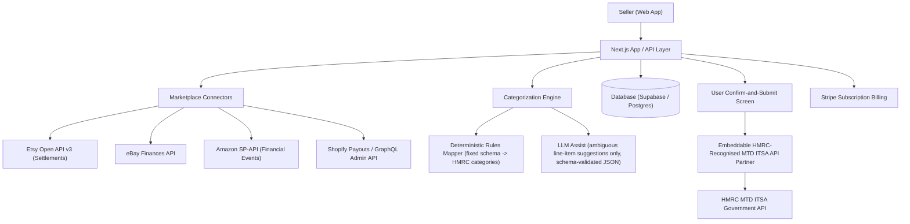

# 🏗️ Technical Architecture Blueprint: MarketLedger MTD

**Status**: APPROVED (6/6 Proofs Passed — see evaluation report for evidence-quality caveats on Proofs 2, 4, 5)
**Target MVP Build Time**: 3–4 Weeks (extended beyond the typical 1–2 week micro-SaaS default due to embeddable MTD-API partner integration lead time and marketplace developer-program approval delays)
**Primary Execution Stack**: Next.js/Vite + Tailwind + Supabase (Postgres) + Marketplace Settlement APIs + Embeddable HMRC-Recognised MTD ITSA Submission Partner API

---

## 1. System Architecture Overview



**Key design principle (from Legal & Regulatory Safety, Section 6 of the evaluation report)**: nothing reaches HMRC without an explicit human confirmation step. The LLM never has write access to the submission path — it only proposes category labels for line items the deterministic rules engine could not confidently classify.

---

## 2. Database Schema (Postgres / Supabase SQL DDL)

```sql
-- Core User Profile Table
CREATE TABLE public.profiles (
    id UUID PRIMARY KEY REFERENCES auth.users(id) ON DELETE CASCADE,
    email TEXT NOT NULL,
    hmrc_utr TEXT, -- Unique Taxpayer Reference (encrypted at rest)
    subscription_tier TEXT DEFAULT 'starter', -- starter (1-2 marketplaces) | growth (3+)
    created_at TIMESTAMPTZ DEFAULT NOW()
);

-- Connected Marketplace Accounts
CREATE TABLE public.marketplace_connections (
    id UUID PRIMARY KEY DEFAULT gen_random_uuid(),
    user_id UUID REFERENCES public.profiles(id) ON DELETE CASCADE,
    marketplace TEXT NOT NULL CHECK (marketplace IN ('etsy','ebay','amazon','shopify','vinted','depop','tiktok_shop')),
    oauth_access_token TEXT, -- encrypted
    oauth_refresh_token TEXT, -- encrypted
    status TEXT DEFAULT 'active',
    connected_at TIMESTAMPTZ DEFAULT NOW()
);

-- Raw Settlement/Payout Line Items (as ingested, before categorization)
CREATE TABLE public.settlement_line_items (
    id UUID PRIMARY KEY DEFAULT gen_random_uuid(),
    user_id UUID REFERENCES public.profiles(id) ON DELETE CASCADE,
    marketplace_connection_id UUID REFERENCES public.marketplace_connections(id),
    external_order_id TEXT,
    line_type TEXT NOT NULL, -- gross_sale | marketplace_fee | ad_spend | refund | shipping_fee | cogs | other
    amount_minor_units BIGINT NOT NULL, -- pence/cents, avoid float rounding
    currency TEXT DEFAULT 'GBP',
    transaction_date DATE NOT NULL,
    raw_payload JSONB DEFAULT '{}'::jsonb,
    created_at TIMESTAMPTZ DEFAULT NOW()
);

-- Category Mapping (deterministic rule match OR LLM-suggested, always user-confirmable)
CREATE TABLE public.category_mappings (
    id UUID PRIMARY KEY DEFAULT gen_random_uuid(),
    settlement_line_item_id UUID REFERENCES public.settlement_line_items(id) ON DELETE CASCADE,
    hmrc_category TEXT NOT NULL, -- fixed enum matching HMRC ITSA quarterly category list
    mapping_source TEXT NOT NULL CHECK (mapping_source IN ('deterministic_rule','llm_suggested','user_manual')),
    confidence NUMERIC(3,2), -- null for deterministic/manual, 0.00-1.00 for llm_suggested
    user_confirmed BOOLEAN DEFAULT FALSE,
    confirmed_at TIMESTAMPTZ
);

-- Quarterly Update Submissions
CREATE TABLE public.quarterly_submissions (
    id UUID PRIMARY KEY DEFAULT gen_random_uuid(),
    user_id UUID REFERENCES public.profiles(id) ON DELETE CASCADE,
    period_start DATE NOT NULL,
    period_end DATE NOT NULL,
    status TEXT DEFAULT 'draft', -- draft | user_confirmed | submitted | hmrc_accepted | hmrc_rejected
    mtd_partner_submission_ref TEXT, -- reference ID from the embeddable MTD API partner
    submitted_at TIMESTAMPTZ,
    audit_log JSONB DEFAULT '[]'::jsonb -- full trail: who confirmed, when, what changed
);
```

---

## 3. Core API Endpoints & Contract Specs

| Endpoint | Method | Input Payload | Output Response | Purpose |
|---|---|---|---|---|
| `/api/v1/marketplaces/connect` | POST | `{ "marketplace": "etsy" }` | `{ "oauth_url": "..." }` | Kick off marketplace OAuth connection |
| `/api/v1/marketplaces/sync` | POST | `{ "connection_id": "..." }` | `{ "line_items_ingested": 142 }` | Pull latest settlement/payout data |
| `/api/v1/categorize/suggest` | POST | `{ "line_item_ids": ["..."] }` | `{ "suggestions": [{ "line_item_id": "...", "hmrc_category": "...", "confidence": 0.86 }] }` | LLM-assisted suggestions for ambiguous items only |
| `/api/v1/quarterly/draft` | GET | `{ "period_start": "...", "period_end": "..." }` | `{ "categories": {...}, "unconfirmed_count": 3 }` | Build the quarterly-update draft for user review |
| `/api/v1/quarterly/submit` | POST | `{ "quarterly_submission_id": "...", "user_confirmation": true }` | `{ "status": "submitted", "mtd_partner_submission_ref": "..." }` | Final confirm-and-submit — hard-blocked without `user_confirmation: true` |
| `/api/v1/webhooks/stripe` | POST | Stripe Event | `{ "received": true }` | Subscription billing sync |

---

## 4. UI/UX Layout Tokens & Screen Hierarchy

- **Screen 1**: Onboarding — Connect Marketplaces (Etsy/eBay/Amazon/Shopify OAuth) + UTR entry
- **Screen 2**: Live Settlement Feed — per-marketplace ingested transactions, sync status
- **Screen 3**: Category Review Queue — deterministic matches shown as confirmed by default; LLM-suggested and unmatched items surfaced for 1-tap accept/edit
- **Screen 4**: Quarterly Draft Summary — HMRC category totals, unconfirmed-item warning banner, "Confirm & Submit" gate
- **Screen 5**: Submission History & Audit Trail — past quarterly updates, HMRC acceptance status, downloadable record
- **Color Palette Tokens**: Primary `#0F766E` (Teal — compliance/trust), Dark `#111827` (Slate 900), Alert/Unconfirmed `#D97706` (Amber), Success `#16A34A` (Green)

---

## 5. Solopreneur MVP Implementation Roadmap (Day 1 – Day 21)

- **Day 1–5**: Marketplace connectors (Etsy + Shopify first — most mature APIs), raw settlement ingestion pipeline, DB schema.
- **Day 6–9**: Deterministic rules-mapping engine (fixed schema → HMRC ITSA category enum); begin embeddable MTD-API partner integration/commercial discussion in parallel (external lead time — start early).
- **Day 10–13**: LLM-assist layer for ambiguous line items (schema-validated JSON output only, never auto-write to submission path); Category Review Queue UI.
- **Day 14–17**: Quarterly Draft Summary + hard-gated Confirm & Submit flow; audit-trail logging; Stripe billing.
- **Day 18–21**: eBay + Amazon SP-API connectors (typically the slowest developer-approval turnaround — budget extra buffer here); pilot categorization-accuracy test against 50–100 real settlement rows (per evaluation report Proof 4 caveat); launch prep.

**Note**: This roadmap assumes the embeddable MTD API partner relationship (Section 6 of the evaluation report) is confirmed and API access granted before Day 14 — if not, the Confirm & Submit flow ships in "export HMRC-ready summary" mode (CSV/PDF handoff to the user's own bridging software) as a fallback MVP, avoiding a hard blocker on the critical path.
